# Specification: Prompt Optimization

## 1. Overview

This specification defines the optimization of the custom slash command prompt system to reduce redundancy, improve Claude-specific formatting, enhance clarity, and ensure consistency across all workflow phases.

### 1.1 Purpose

Transform the existing 8 prompts and 7 templates into an optimized, maintainable system that:
- Reduces token usage by ~20-25%
- Improves response quality and format compliance
- Establishes DRY (Don't Repeat Yourself) patterns
- Leverages Claude-specific optimizations (XML tags)

### 1.2 Scope

| In Scope | Out of Scope |
|----------|--------------|
| All 8 prompt files (1_research through 8_review) | Claude Code CLI modifications |
| All 7 template files | New workflow phases |
| Shared content extraction | i18n/localization system |
| XML structure conversion | Automated testing framework |
| Placeholder standardization | Prompt versioning system |

### 1.3 References
- Research Document: `docs/research/20241218-prompt-optimization.md`

---

## 2. User Stories

### US-001: Eliminate Duplicate Content
**As a** prompt maintainer
**I want** file naming rules extracted to a shared location
**So that** I can update them once and have changes apply everywhere

**Acceptance Criteria:**
- [ ] AC-001: File naming rules exist in single `_shared/file-naming-rules.md` file
- [ ] AC-002: All prompts reference the shared file instead of duplicating content
- [ ] AC-003: Total line reduction of ~150-200 lines across all prompts

### US-002: Apply XML Structure
**As a** developer using the system
**I want** prompts to use XML tags for section boundaries
**So that** Claude can parse instructions more accurately

**Acceptance Criteria:**
- [ ] AC-001: All prompts use `<role>`, `<process>`, `<rules>`, `<output>` XML tags
- [ ] AC-002: Step definitions use `<step n="N">` format
- [ ] AC-003: Critical constraints wrapped in `<critical>` tags

### US-003: Standardize Placeholders
**As a** prompt maintainer
**I want** consistent placeholder syntax across all prompts
**So that** there is no ambiguity in variable substitution

**Acceptance Criteria:**
- [ ] AC-001: All placeholders use `{{PLACEHOLDER}}` syntax
- [ ] AC-002: No mixed formats (`{feature}`, `$ARGUMENTS`) remain
- [ ] AC-003: Placeholder reference document created

### US-004: Add Few-Shot Examples
**As a** developer using the system
**I want** concrete examples in file naming sections
**So that** Claude produces correctly formatted output

**Acceptance Criteria:**
- [ ] AC-001: Each prompt includes at least 1 input→output example
- [ ] AC-002: Examples cover Japanese and English inputs
- [ ] AC-003: Examples wrapped in `<example>` XML tags

### US-005: Convert to Affirmative Directives
**As a** developer using the system
**I want** instructions phrased as "DO X" instead of "DON'T do Y"
**So that** Claude follows clear, positive instructions

**Acceptance Criteria:**
- [ ] AC-001: All negative instructions converted to affirmative form
- [ ] AC-002: No "DON'T", "DO NOT", "NEVER" (without affirmative alternative) remain
- [ ] AC-003: Critical constraints restated as required actions

### US-006: Reduce Token Usage
**As a** system operator
**I want** prompts optimized for token efficiency
**So that** API costs are reduced and responses are faster

**Acceptance Criteria:**
- [ ] AC-001: Total token reduction of 1,000-1,500 tokens across all prompts
- [ ] AC-002: Redundant "CRITICAL" warnings consolidated
- [ ] AC-003: Error message templates compressed

---

## 3. File Interface

Since this is a file-based system (not API), this section defines the file structure and naming conventions.

### 3.1 Directory Structure

```
prompts/
├── _shared/                          # NEW: Shared content
│   ├── file-naming-rules.md          # Extracted from all prompts
│   ├── output-constraints.md         # Common output rules
│   ├── quality-standards.md          # Reusable checklists
│   └── placeholders.md               # Placeholder reference
├── 1_research.md                     # Optimized prompts
├── 2_spec.md
├── 3_plan.md
├── 4_debug.md
├── 5_refactor.md
├── 6_change.md
├── 7_do.md
├── 8_review.md
└── templates/                        # Existing templates
    ├── research_template.md
    ├── spec_template.md
    ├── plan_template.md
    ├── bug_analysis_template.md
    ├── refactor_design_template.md
    ├── change_template.md
    └── review_template.md
```

### 3.2 Shared File Definitions

#### `_shared/file-naming-rules.md`

```markdown
<file-naming>
<rules>
1. Extract identifier from input (remove date prefix if present)
2. Convert to kebab-case (lowercase, hyphens)
3. Prepend today's date as YYYYMMDD
4. Result: `{{DATE}}-{{IDENTIFIER}}.md`
</rules>

<examples>
<example>
<input>ユーザー認証機能を追加</input>
<identifier>user-auth</identifier>
<filename>20241218-user-auth.md</filename>
</example>

<example>
<input>Add payment processing</input>
<identifier>payment-processing</identifier>
<filename>20241218-payment-processing.md</filename>
</example>

<example>
<input>20241215-api-refactor</input>
<identifier>api-refactor</identifier>
<filename>20241218-api-refactor.md</filename>
</example>
</examples>
</file-naming>
```

#### `_shared/output-constraints.md`

```markdown
<output-constraints>
<critical>
Write output ONLY to specified file path.
Console output = summary confirmation only.
Source document is your single source of truth.
</critical>

<format>
After writing, confirm with:
- File path written
- Key metrics (counts)
- Next step command
</format>
</output-constraints>
```

#### `_shared/placeholders.md`

| Placeholder | Description | Example |
|-------------|-------------|---------|
| `{{FEATURE_NAME}}` | Feature identifier (kebab-case) | `user-auth` |
| `{{DATE}}` | Current date (YYYYMMDD) | `20241218` |
| `{{INPUT}}` | Raw user input | `ユーザー認証` |
| `{{IDENTIFIER}}` | Normalized identifier | `user-auth` |

---

## 4. Data Models

### 4.1 Entity: Prompt

| Field | Type | Required | Description |
|-------|------|----------|-------------|
| name | string | Yes | Prompt file name (e.g., `1_research.md`) |
| role | string | Yes | Role definition for Claude |
| process | array | Yes | List of steps |
| rules | array | Yes | Constraints and requirements |
| output | object | Yes | Output format specification |

### 4.2 Entity: SharedContent

| Field | Type | Required | Description |
|-------|------|----------|-------------|
| id | string | Yes | File name (e.g., `file-naming-rules`) |
| content | string | Yes | Reusable content block |
| usedBy | array | Yes | List of prompts using this content |

### 4.3 Entity Relationships

```mermaid
erDiagram
    PROMPT ||--o{ SHARED_CONTENT : includes
    PROMPT ||--o| TEMPLATE : uses

    PROMPT {
        string name PK
        string role
        array process
        array rules
        object output
    }

    SHARED_CONTENT {
        string id PK
        string content
        array usedBy
    }

    TEMPLATE {
        string name PK
        string content
        array placeholders
    }
```



---

## 5. System Flow

### 5.1 Prompt Execution Sequence


### 5.2 Content Assembly Flow


### 5.3 State Diagram: Prompt Optimization Workflow


---

## 6. Edge Cases & Error Handling

| Scenario | Expected Behavior | Resolution |
|----------|-------------------|------------|
| Missing shared file | Graceful degradation with warning | Use inline fallback content |
| Invalid placeholder syntax | Preserve literal text | Log warning, continue execution |
| Japanese input with special chars | Normalize to ASCII-safe kebab-case | Use transliteration mapping |
| Empty input | Prompt for clarification | Return error message |
| Circular include reference | Detect and abort | Log error, skip circular ref |
| Date format mismatch | Use current system date | Default to ISO format |

---

## 7. Security Considerations

### 7.1 Authentication
Not applicable - local file-based system.

### 7.2 Authorization
File system permissions control access to prompt files.

### 7.3 Data Protection
- No sensitive data in prompts
- Output files may contain business logic - follow existing repo security practices
- Avoid logging full prompt content in error messages

---

## 8. Performance Requirements

| Metric | Target | Measurement Method |
|--------|--------|--------------------|
| Token Reduction | 20-25% | Compare before/after token counts |
| Prompt Load Time | < 100ms | Time from command to Claude invocation |
| Response Consistency | > 95% format compliance | Manual review of 20 outputs |

---

## 9. Testing Strategy

### 9.1 Unit Tests
- Validate placeholder substitution
- Verify file naming normalization (Japanese → kebab-case)
- Check XML tag parsing

### 9.2 Integration Tests
- Execute each slash command with sample inputs
- Verify output file creation in correct directory
- Validate output format matches template

### 9.3 E2E Tests
- Full workflow: `/research` → `/spec` → `/plan` → `/do`
- Cross-language inputs (English, Japanese)
- Edge case inputs (special characters, long names)

---

## 10. Implementation Checklist

### Phase 1: Shared Content Extraction
- [ ] Create `prompts/_shared/` directory
- [ ] Extract `file-naming-rules.md` from all prompts
- [ ] Extract `output-constraints.md` from all prompts
- [ ] Create `placeholders.md` reference
- [ ] Update prompts to reference shared files

### Phase 2: XML Structure Conversion
- [ ] Convert `1_research.md` to XML format
- [ ] Convert `2_spec.md` to XML format
- [ ] Convert `3_plan.md` to XML format
- [ ] Convert `4_debug.md` to XML format
- [ ] Convert `5_refactor.md` to XML format
- [ ] Convert `6_change.md` to XML format
- [ ] Convert `7_do.md` to XML format
- [ ] Convert `8_review.md` to XML format

### Phase 3: Content Optimization
- [ ] Standardize all placeholders to `{{PLACEHOLDER}}` syntax
- [ ] Convert negative directives to affirmative form
- [ ] Add few-shot examples to each prompt
- [ ] Compress error message templates
- [ ] Consolidate redundant warnings

### Phase 4: Validation
- [ ] Test each prompt with sample inputs
- [ ] Measure token counts (before/after)
- [ ] Verify output format compliance
- [ ] Document any breaking changes

---

## 11. Open Items

- [ ] Decide: Should command files be merged into prompt files?
- [ ] Decide: English-only vs bilingual error messages?
- [ ] Decide: Include mechanism - @reference syntax or manual copy?
- [ ] Clarify: Tolerance for breaking changes to existing outputs?

---
**Created:** 2024-12-18
**Last Updated:** 2024-12-18
**Status:** Draft
**Author:** Claude (AI Assistant)
