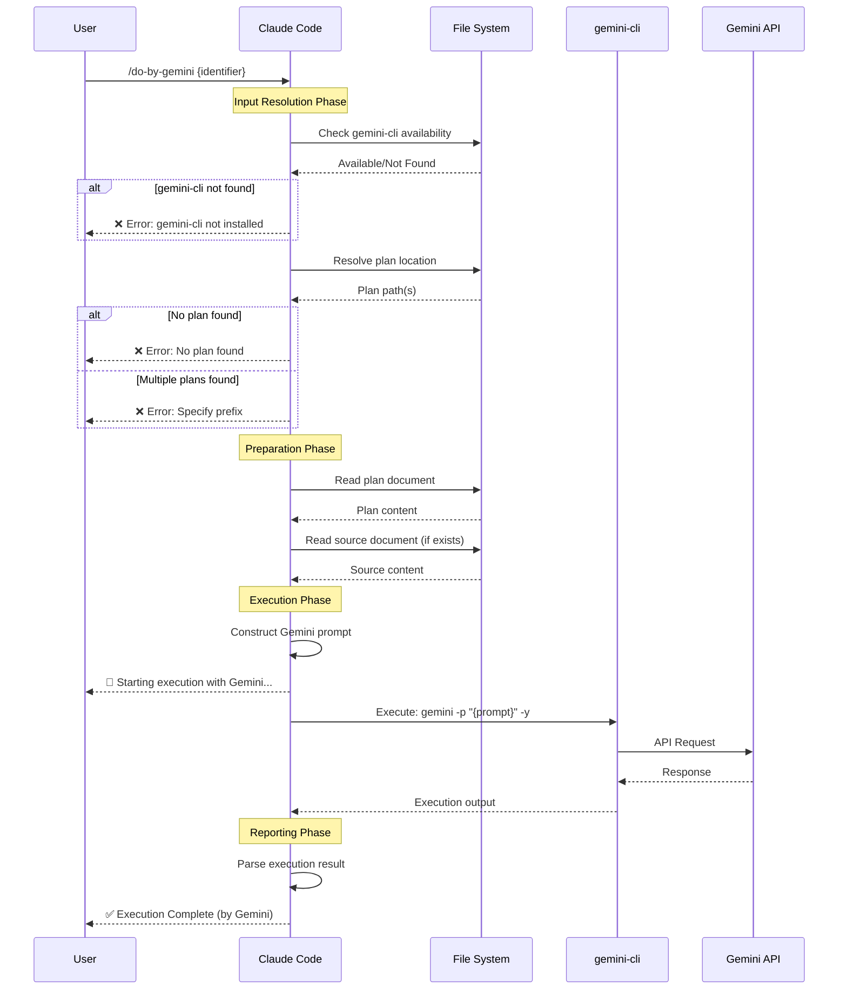
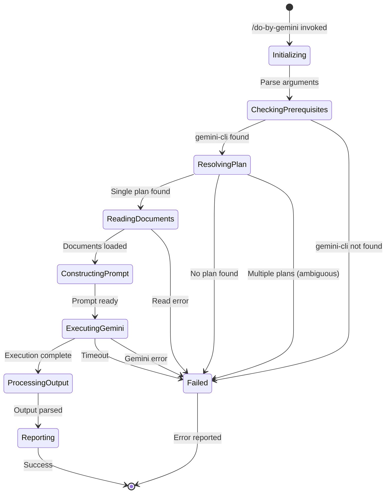

# Specification: /do-by-gemini Command

## 1. Overview

### 1.1 Purpose

`/do-by-gemini` は、SDD（Spec-Driven Development）パイプラインにおいて、実装計画の実行を Claude Code ではなく Google の `gemini-cli` に委譲するコマンドです。これにより、ユーザーは異なる AI モデルの実装アプローチを比較したり、特定のタスクに Gemini の強みを活用することができます。

### 1.2 Scope

| In Scope | Out of Scope |
|----------|--------------|
| 既存 `/do` と同じ入力解決ロジック | Gemini モデルの選択オプション（将来検討） |
| Plan ドキュメントの読み込みと解析 | チェックポイント機能の制御（将来検討） |
| `gemini-cli` への実行委譲 | 対話的な実行モード |
| 実行結果のレポート | Gemini API の設定管理 |
| エラーハンドリング | 複数 AI 間のハイブリッド実行 |

### 1.3 References
- Research Document: `docs/research/20260121-do-by-gemini.md`
- Related Command: `commands/do.md`
- Execution Prompt: `prompts/7_do.md`

---

## 2. User Stories

### US-001: Gemini による Plan 実行
**As a** 開発者
**I want** 作成済みの Plan を Gemini で実行したい
**So that** 異なる AI モデルの実装アプローチを試すことができる

**Acceptance Criteria:**
- [ ] AC-001: `/do-by-gemini {identifier}` で Plan を指定できる
- [ ] AC-002: 指定された Plan ドキュメントが正しく読み込まれる
- [ ] AC-003: `gemini-cli` が Plan 内容を含むプロンプトで実行される
- [ ] AC-004: 実行結果が一貫したフォーマットで報告される

### US-002: 既存 `/do` と同等の入力解決
**As a** 開発者
**I want** `/do` と同じ方法で Plan を指定したい
**So that** 新しいコマンドを学習するコストを最小化できる

**Acceptance Criteria:**
- [ ] AC-001: 自動タイプ解決が動作する（features/fixes/refactors/changes）
- [ ] AC-002: プレフィックス記法（`feature:`, `fix:` 等）がサポートされる
- [ ] AC-003: Plan が見つからない場合、適切なエラーメッセージが表示される
- [ ] AC-004: 複数の Plan が見つかった場合、明示的な指定を促すエラーが表示される

### US-003: エラーハンドリング
**As a** 開発者
**I want** `gemini-cli` が利用できない場合に明確なエラーを受け取りたい
**So that** 問題を迅速に診断して解決できる

**Acceptance Criteria:**
- [ ] AC-001: `gemini-cli` が PATH に存在しない場合、明確なエラーメッセージを表示
- [ ] AC-002: Gemini API のエラー時に適切なエラーメッセージを表示
- [ ] AC-003: タイムアウト発生時にユーザーに通知

### US-004: 実行状況の可視化
**As a** 開発者
**I want** Gemini が実行中であることを明確に知りたい
**So that** Claude ではなく Gemini が処理していることを認識できる

**Acceptance Criteria:**
- [ ] AC-001: 実行開始時に Gemini で実行中であることを表示
- [ ] AC-002: 実行完了後に Gemini による実行であったことを明記

---

## 3. Command Interface

### 3.1 Command Syntax

#### `/do-by-gemini {identifier}`

**Description:** 指定された Plan を `gemini-cli` で実行する

**Arguments:**
```
{identifier} - Plan の識別子（必須）
  - 単純識別子: `20260121-user-auth`
  - プレフィックス付き: `feature:user-auth`, `fix:login-bug`
```

**Plan Resolution Logic:**
```
1. plans/features/{identifier}.md exists → Execute as feature
2. plans/fixes/{identifier}.md exists → Execute as bug fix
3. plans/refactors/{identifier}.md exists → Execute as refactoring
4. plans/changes/{identifier}.md exists → Execute as change
5. Multiple exist → Error + require explicit prefix
6. None exist → Error + show guidance
```

**Prefix Notation:**
```
/do-by-gemini feature:{name}    → docs/plans/features/{name}.md
/do-by-gemini fix:{id}          → docs/plans/fixes/{id}.md
/do-by-gemini refactor:{target} → docs/plans/refactors/{target}.md
/do-by-gemini change:{feature}  → docs/plans/changes/{feature}.md
```

### 3.2 Gemini CLI Invocation

**Command Pattern:**
```bash
gemini -p "{constructed_prompt}" -y
```

**Flags Used:**
| Flag | Purpose |
|------|---------|
| `-p` | Direct prompt input |
| `-y` | YOLO mode (auto-accept all actions) |

---

## 4. Data Models

### 4.1 Entity: PlanDocument

| Field | Type | Required | Description |
|-------|------|----------|-------------|
| identifier | string | Yes | Plan の一意識別子 |
| type | enum | Yes | feature \| fix \| refactor \| change |
| path | string | Yes | Plan ファイルへのパス |
| content | string | Yes | Plan ドキュメントの内容 |
| sourceDocPath | string | No | 参照元ドキュメント（Spec/Analysis）のパス |

### 4.2 Entity: ExecutionContext

| Field | Type | Required | Description |
|-------|------|----------|-------------|
| plan | PlanDocument | Yes | 実行対象の Plan |
| executor | string | Yes | "gemini-cli" |
| flags | string[] | Yes | 使用する CLI フラグ |
| timeout | number | No | タイムアウト（ミリ秒） |

### 4.3 Entity: ExecutionResult

| Field | Type | Required | Description |
|-------|------|----------|-------------|
| success | boolean | Yes | 実行成功フラグ |
| output | string | Yes | Gemini からの出力 |
| exitCode | number | Yes | プロセス終了コード |
| errorMessage | string | No | エラー時のメッセージ |

---

## 5. System Flow

### 5.1 Sequence Diagram - Main Execution Flow



### 5.2 State Diagram - Command Execution States



---

## 6. Prompt Construction

### 6.1 Gemini Prompt Template

```
You are an expert developer executing an implementation plan.

## Plan Document
{plan_content}

## Source Document (Reference)
{source_document_content}

## Instructions
1. Follow the plan step by step - do NOT skip or reorder
2. Write actual source code to specified files
3. Run verification checks after each phase
4. Do NOT add features not in the source document
5. Write tests alongside implementation

## Constraints
- Follow project coding conventions
- Include appropriate error handling
- No linting or type errors allowed
- Cover code with tests as specified

Execute this plan now.
```

---

## 7. Edge Cases & Error Handling

| Scenario | Expected Behavior | Error Message |
|----------|-------------------|---------------|
| `gemini-cli` not installed | 実行前チェックで失敗 | `❌ Error: gemini-cli not found. Please install it first.` |
| Plan not found | ガイダンス付きエラー表示 | `❌ Error: No plan found for '{identifier}'` + creation guidance |
| Multiple plans match | 明示的指定を促す | `❌ Error: Multiple plans found. Please specify: /do-by-gemini feature:{id}` |
| Plan file read error | ファイル読み込みエラー | `❌ Error: Could not read plan file: {path}` |
| Gemini API error | API エラーメッセージを表示 | `❌ Gemini Error: {api_error_message}` |
| Execution timeout | タイムアウト通知 | `⏱️ Execution timed out. The task may still be running.` |
| Empty plan content | 無効な Plan として拒否 | `❌ Error: Plan document is empty: {path}` |

---

## 8. Security Considerations

### 8.1 Authentication
- Gemini API 認証は `gemini-cli` の設定に依存
- Claude Code による追加認証は不要

### 8.2 Authorization
- ファイルシステムアクセスは既存の Claude Code 権限に従う
- `gemini-cli` は独自の権限モデルで動作

### 8.3 Data Protection
- Plan ドキュメントの内容が Gemini API に送信される点をユーザーに認識させる
- 機密情報を含む Plan の実行には注意が必要

---

## 9. Performance Requirements

| Metric | Target | Measurement Method |
|--------|--------|--------------------|
| Plan Resolution | < 100ms | 内部計測 |
| Gemini Invocation Start | < 1s | コマンド実行からプロセス起動まで |
| Default Timeout | 10 minutes | Bash timeout parameter |

---

## 10. File Structure

### 10.1 New Files to Create

```
commands/do-by-gemini.md      # Entry point (slash command definition)
prompts/9_do_by_gemini.md     # Detailed execution logic
```

### 10.2 Command Entry Point Structure

```markdown
---
description: "Execute implementation plans using gemini-cli"
---

# Execution Phase - Gemini Delegation

Execute the implementation plan using Gemini: **$ARGUMENTS**

## Instructions
Read and follow the prompt logic at: `~/.prompts/9_do_by_gemini.md`
...
```

---

## 11. Testing Strategy

### 11.1 Unit Tests
- 入力解決ロジックのテスト（単純識別子、プレフィックス記法）
- エラーメッセージ生成のテスト

### 11.2 Integration Tests
- `gemini-cli` 存在確認のテスト
- Plan ドキュメント読み込みのテスト
- Gemini プロンプト構築のテスト

### 11.3 E2E Tests
- 実際の Plan を使用した Gemini 実行テスト
- エラーシナリオの E2E テスト

---

## 12. Open Items
- [ ] Gemini モデル選択オプション（`-m` フラグ）のサポート
- [ ] チェックポイント機能（`-c` フラグ）のデフォルト設定
- [ ] 部分実行失敗時のリカバリ戦略の詳細

---
**Created:** 2026-01-21
**Last Updated:** 2026-01-21
**Status:** Draft
**Author:** Claude Code
