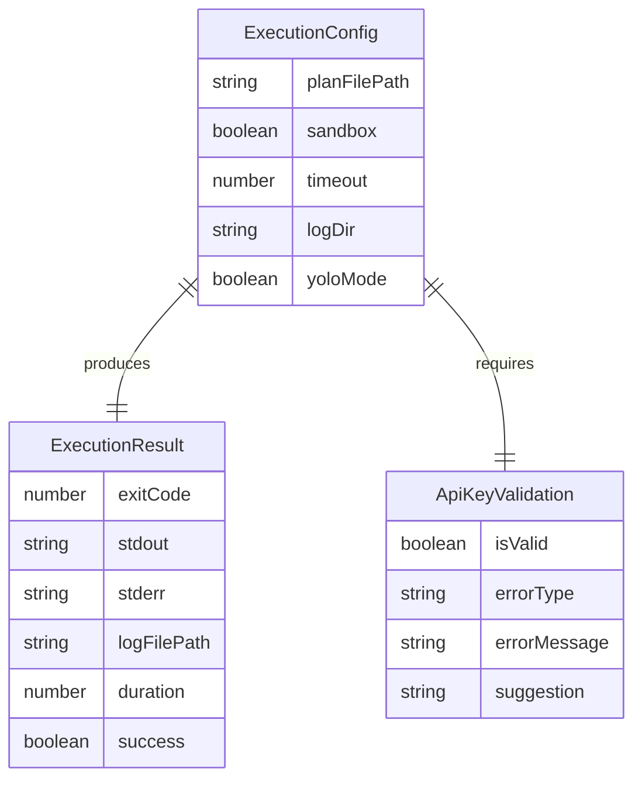
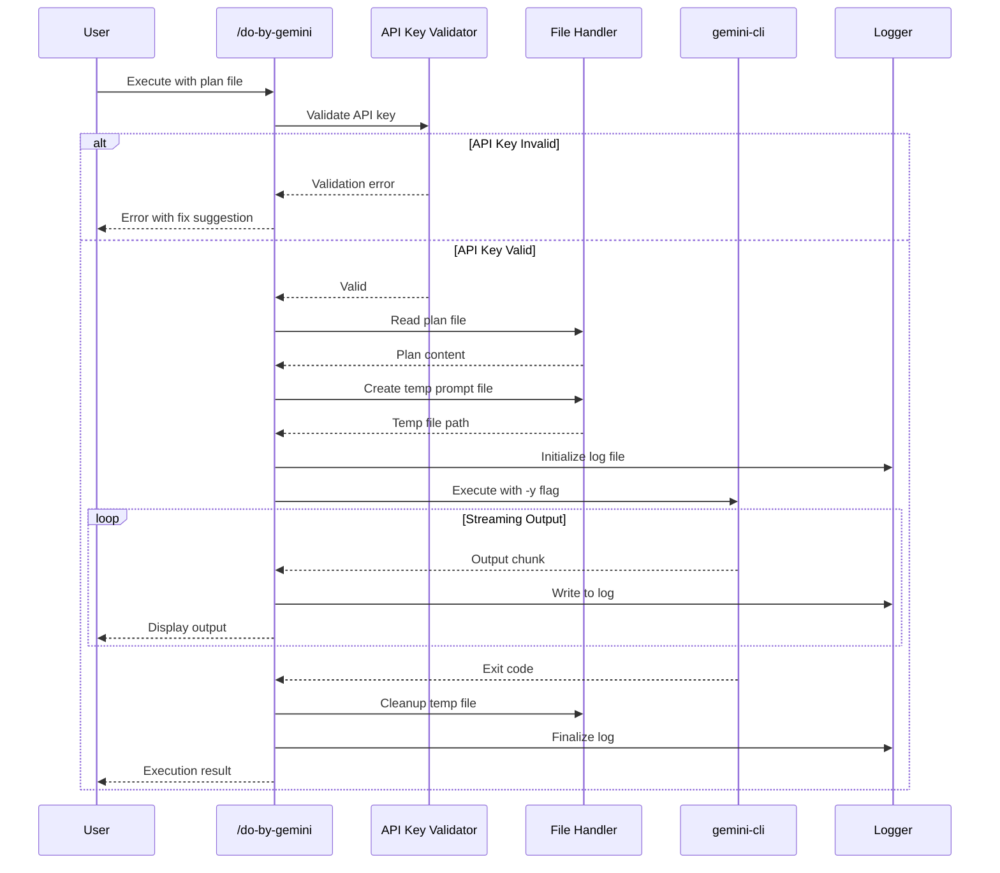
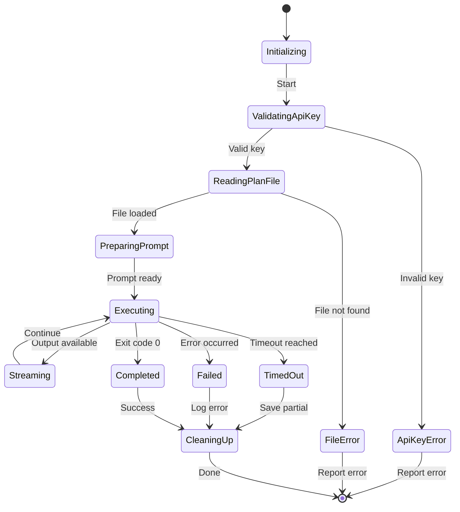
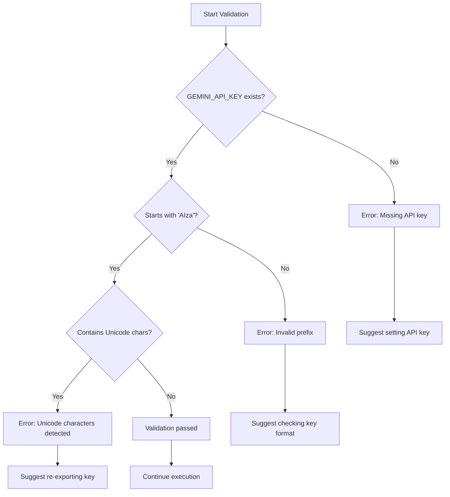

# Specification: Gemini CLI Agentic Execution Fix

## 1. Overview

### 1.1 Purpose
`/do-by-gemini` コマンドで gemini-cli を使用した agentic 実行を正常に動作させる。API キーの Unicode 文字問題を解決し、ファイル編集を含む agentic 操作を確実に実行できるようにする。

### 1.2 Scope

| In Scope | Out of Scope |
|----------|--------------|
| API キーの検証と修正 | gemini-cli 本体の修正 |
| ファイルベースのプロンプト渡し実装 | 新しい CLI ツールの開発 |
| ストリーミング出力のログ保存 | GUI インターフェースの提供 |
| エラーハンドリングの強化 | 他の AI CLI ツールとの統合 |
| Sandbox 設定の適切な管理 | 認証フローの変更 |

### 1.3 References
- Research Document: `docs/research/20260121-gemini-cli-agentic-execution.md`
- gemini-cli documentation: https://github.com/google-gemini/gemini-cli

---

## 2. User Stories

### US-001: API キーの検証
**As a** Developer
**I want** gemini-cli 実行前に API キーの有効性を検証したい
**So that** 不正な文字による実行エラーを事前に検出できる

**Acceptance Criteria:**
- [ ] AC-001: API キーが `AIza` で始まることを検証する
- [ ] AC-002: API キーに不可視の Unicode 文字が含まれていないことを検証する
- [ ] AC-003: 検証失敗時に明確なエラーメッセージを表示する
- [ ] AC-004: エラーメッセージに修正方法を含める

### US-002: ファイルベースのプロンプト実行
**As a** Developer
**I want** 長いプロンプトをファイル経由で gemini-cli に渡したい
**So that** エンコーディング問題を回避し、安定した実行ができる

**Acceptance Criteria:**
- [ ] AC-001: プロンプトを一時ファイルに安全に書き出す
- [ ] AC-002: 一時ファイルから gemini-cli にプロンプトを渡す
- [ ] AC-003: 実行完了後に一時ファイルを削除する
- [ ] AC-004: マルチバイト文字を正しく処理する

### US-003: リアルタイムストリーミング出力
**As a** Developer
**I want** gemini-cli の出力をリアルタイムで確認したい
**So that** 実行状況を把握しながら作業できる

**Acceptance Criteria:**
- [ ] AC-001: 出力がリアルタイムでコンソールに表示される
- [ ] AC-002: 出力が同時にログファイルに保存される
- [ ] AC-003: バッファリングによる遅延が最小限である

### US-004: Agentic モードでのファイル編集
**As a** Developer
**I want** gemini-cli がファイル編集を自動実行できるようにしたい
**So that** 計画の実装を自動化できる

**Acceptance Criteria:**
- [ ] AC-001: YOLO モード (-y) で自動承認が有効になる
- [ ] AC-002: Sandbox 設定が適切に管理される
- [ ] AC-003: ファイル編集操作が正常に実行される
- [ ] AC-004: 編集結果がログに記録される

### US-005: エラー診断とリカバリ
**As a** Developer
**I want** エラー発生時に詳細な診断情報を取得したい
**So that** 問題を迅速に特定・解決できる

**Acceptance Criteria:**
- [ ] AC-001: API エラーの詳細がログに記録される
- [ ] AC-002: タイムアウト時に部分結果が保存される
- [ ] AC-003: エラーの種類に応じた対処方法が提示される

---

## 3. CLI Interface

### 3.1 Commands

#### `/do-by-gemini`

**Description:** gemini-cli を使用して計画ファイルを agentic に実行する

**Usage:**
```bash
/do-by-gemini <plan-file-path> [options]
```

**Options:**

| Option | Type | Required | Default | Description |
|--------|------|----------|---------|-------------|
| `--sandbox` | boolean | No | true | Sandbox モードの有効/無効 |
| `--timeout` | number | No | 300000 | タイムアウト（ミリ秒） |
| `--log-dir` | string | No | `/tmp` | ログファイルの出力先 |
| `--dry-run` | boolean | No | false | 実行せずに検証のみ |

**Exit Codes:**

| Code | Description |
|------|-------------|
| 0 | 正常終了 |
| 1 | API キーエラー |
| 2 | プロンプトファイルエラー |
| 3 | gemini-cli 実行エラー |
| 4 | タイムアウト |

---

## 4. Data Models

### 4.1 Entity: ExecutionConfig

| Field | Type | Required | Description |
|-------|------|----------|-------------|
| planFilePath | string | Yes | 計画ファイルのパス |
| sandbox | boolean | Yes | Sandbox モードの有効/無効 |
| timeout | number | Yes | タイムアウト（ミリ秒） |
| logDir | string | Yes | ログファイルの出力先 |
| yoloMode | boolean | Yes | 自動承認モードの有効/無効 |

### 4.2 Entity: ExecutionResult

| Field | Type | Required | Description |
|-------|------|----------|-------------|
| exitCode | number | Yes | 終了コード |
| stdout | string | Yes | 標準出力 |
| stderr | string | Yes | 標準エラー出力 |
| logFilePath | string | Yes | ログファイルのパス |
| duration | number | Yes | 実行時間（ミリ秒） |
| success | boolean | Yes | 実行成功フラグ |

### 4.3 Entity: ApiKeyValidation

| Field | Type | Required | Description |
|-------|------|----------|-------------|
| isValid | boolean | Yes | 検証結果 |
| errorType | string | No | エラータイプ（invalid_prefix, unicode_chars, missing） |
| errorMessage | string | No | エラーメッセージ |
| suggestion | string | No | 修正提案 |

### 4.4 Entity Relationships



---

## 5. System Flow

### 5.1 Sequence Diagram - Main Execution Flow



### 5.2 State Diagram - Execution States



### 5.3 API Key Validation Flow



---

## 6. Edge Cases & Error Handling

| Scenario | Expected Behavior | Error Code |
|----------|-------------------|------------|
| API キーが未設定 | 明確なエラーメッセージと設定方法を表示 | 1 |
| API キーに不正文字 | 検出して修正方法を提示 | 1 |
| 計画ファイルが存在しない | ファイルパスの確認を促す | 2 |
| 計画ファイルが空 | 警告を表示して中止 | 2 |
| gemini-cli がインストールされていない | インストール方法を表示 | 3 |
| gemini-cli 実行中にクラッシュ | 部分ログを保存してエラー報告 | 3 |
| タイムアウト | 部分結果を保存して警告 | 4 |
| ネットワークエラー | リトライ提案を表示 | 3 |
| Sandbox によるファイル編集制限 | Sandbox 無効化オプションを提示 | 3 |

---

## 7. Security Considerations

### 7.1 Authentication
- Gemini API キーは環境変数 `GEMINI_API_KEY` から取得
- API キーをログファイルに出力しない
- API キーを一時ファイルに保存しない

### 7.2 Authorization
- YOLO モード使用時はユーザーの明示的な同意が必要
- Sandbox モードのデフォルト有効化で意図しないファイル変更を防止

### 7.3 Data Protection
- 一時ファイルは実行完了後に確実に削除
- ログファイルには機密情報を含めない
- プロンプト内の機密情報はマスキング検討

---

## 8. Performance Requirements

| Metric | Target | Measurement Method |
|--------|--------|--------------------|
| API キー検証 | < 10ms | 同期処理時間 |
| 一時ファイル作成 | < 50ms | I/O 処理時間 |
| ストリーミング遅延 | < 100ms | バッファからコンソールまでの時間 |
| タイムアウト精度 | ±1000ms | 設定値との差異 |

---

## 9. Testing Strategy

### 9.1 Unit Tests
- API キー検証ロジック（正常系、異常系）
- Unicode 文字検出ロジック
- 一時ファイル作成・削除
- ログファイル書き込み

### 9.2 Integration Tests
- gemini-cli の実行（モック API 使用）
- ストリーミング出力のキャプチャ
- エラーハンドリングのエンドツーエンド

### 9.3 E2E Tests
- 実際の API キーでの実行（CI 環境）
- 計画ファイルの読み込みから実行完了まで
- タイムアウト動作の確認

---

## 10. Implementation Notes

### 10.1 API Key Validation Implementation

```bash
# Recommended validation approach
validate_api_key() {
    local api_key="${GEMINI_API_KEY:-}"

    # Check if key exists
    if [[ -z "$api_key" ]]; then
        echo "Error: GEMINI_API_KEY is not set"
        return 1
    fi

    # Check prefix
    if [[ ! "$api_key" =~ ^AIza ]]; then
        echo "Error: Invalid API key format (should start with 'AIza')"
        return 1
    fi

    # Check for Unicode characters (using xxd)
    if printenv GEMINI_API_KEY | xxd | grep -q 'e280'; then
        echo "Error: API key contains invisible Unicode characters"
        echo "Fix: Re-export the key without copy-paste artifacts"
        return 1
    fi

    return 0
}
```

### 10.2 File-based Prompt Execution

```bash
# Recommended execution approach
execute_with_file_prompt() {
    local plan_content="$1"
    local log_file="$2"

    # Create temp file
    local prompt_file
    prompt_file=$(mktemp)

    # Write prompt to temp file (safe for multi-byte)
    printf '%s' "$plan_content" > "$prompt_file"

    # Execute with streaming output
    cat "$prompt_file" | gemini -y 2>&1 | tee "$log_file"
    local exit_code=${PIPESTATUS[1]}

    # Cleanup
    rm -f "$prompt_file"

    return $exit_code
}
```

---

## 11. Open Items

- [ ] Sandbox 無効化のセキュリティ影響の詳細評価
- [ ] 長時間実行時のチェックポイント機能の必要性検討
- [ ] 複数の計画ファイルの連続実行サポート
- [ ] 実行結果のサマリーレポート機能

---
**Created:** 2026-01-21
**Last Updated:** 2026-01-21
**Status:** Draft
**Author:** Claude Code
