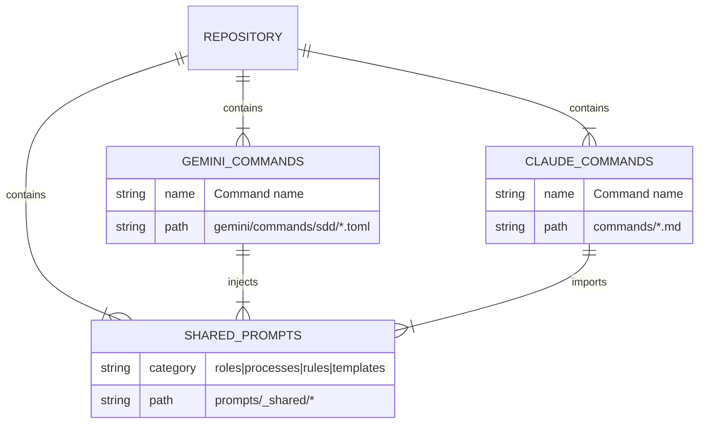
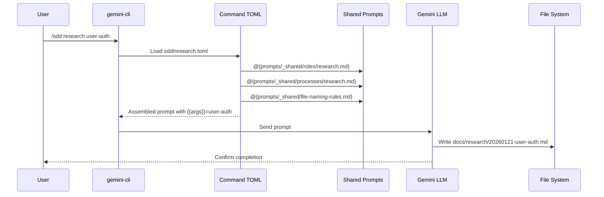
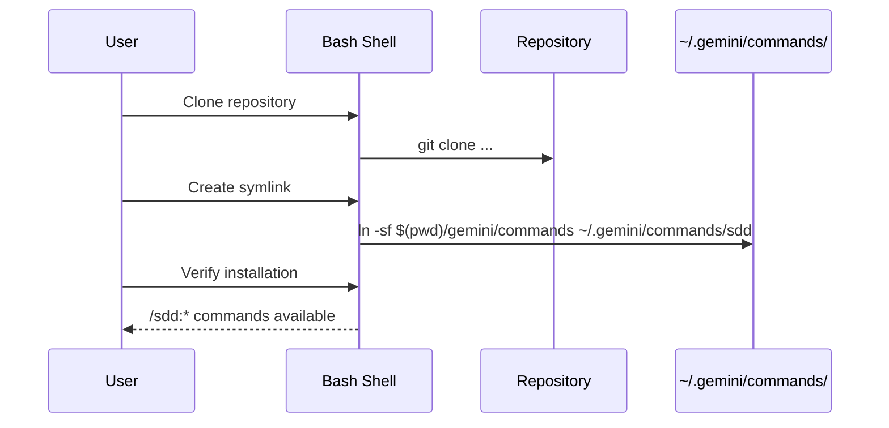
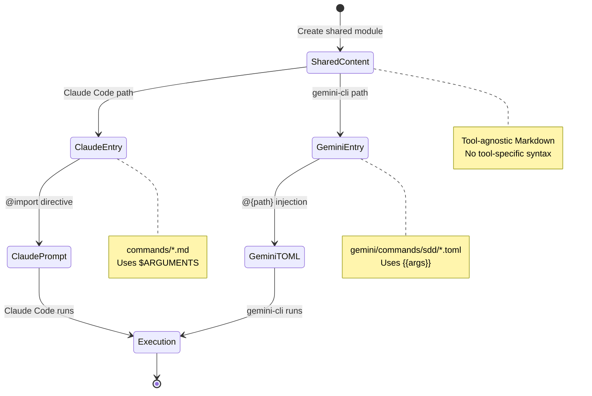

# Specification: gemini-cli Shared Prompts Architecture

## 1. Overview

### 1.1 Purpose
gemini-cli向けのカスタムスラッシュコマンドを作成し、Claude Codeの既存コマンドと同じプロンプトロジックを共有する。これにより、両ツールで一貫したSDD（Spec-Driven Development）ワークフロー（/research → /spec → /plan → /do → /review）を実現する。

### 1.2 Scope

| In Scope | Out of Scope |
|----------|--------------|
| gemini-cli用SDD コマンド群の作成 | gemini-cli本体の機能拡張 |
| 共通プロンプトモジュールの設計 | Claude Code側の大幅なリファクタリング |
| TOML形式でのコマンド定義 | ビルドスクリプトによる自動生成（v2以降） |
| シンボリックリンクによるインストール | GUI/Web インターフェース |
| 名前空間付きコマンド（/sdd:*） | 他のAIツールへの対応 |

### 1.3 References
- Research Document: `docs/research/20260121-gemini-cli-shared-prompts.md`

---

## 2. User Stories

### US-001: gemini-cli で SDD ワークフローを実行
**As a** 開発者
**I want** gemini-cli で /sdd:research, /sdd:spec, /sdd:plan, /sdd:do コマンドを使用できる
**So that** Claude Code と同じ SDD ワークフローを gemini-cli でも実行できる

**Acceptance Criteria:**
- [ ] AC-001: `/sdd:research {feature}` で docs/research/{date}-{feature}.md にリサーチドキュメントを生成できる
- [ ] AC-002: `/sdd:spec {feature}` で docs/specs/{date}-{feature}.md に仕様書を生成できる
- [ ] AC-003: `/sdd:plan {feature}` で docs/plans/{date}-{feature}.md に実装計画を生成できる
- [ ] AC-004: `/sdd:do {feature}` で計画に基づいた実装を開始できる

### US-002: 共通プロンプトロジックの共有
**As a** メンテナー
**I want** Claude Code と gemini-cli のコマンドが同じプロンプトロジックを共有する
**So that** 一箇所の変更で両ツールに反映され、メンテナンスコストを削減できる

**Acceptance Criteria:**
- [ ] AC-001: 役割定義（Role）が prompts/_shared/roles/ に共通化されている
- [ ] AC-002: 処理手順（Process）が prompts/_shared/processes/ に共通化されている
- [ ] AC-003: ファイル命名規則が prompts/_shared/file-naming-rules.md に共通化されている
- [ ] AC-004: 出力テンプレートが prompts/templates/ に共通化されている

### US-003: 簡単なセットアップ
**As a** ユーザー
**I want** シンプルなコマンドで gemini-cli コマンドをインストールできる
**So that** 最小限の手順で使用を開始できる

**Acceptance Criteria:**
- [ ] AC-001: シンボリックリンク1コマンドでインストールが完了する
- [ ] AC-002: インストール後すぐに /sdd:* コマンドが使用可能になる
- [ ] AC-003: README に明確なインストール手順が記載されている

### US-004: 拡張コマンドの利用
**As a** 開発者
**I want** /sdd:debug, /sdd:refactor, /sdd:change, /sdd:review コマンドを使用できる
**So that** 完全な開発ワークフローを gemini-cli で実行できる

**Acceptance Criteria:**
- [ ] AC-001: `/sdd:debug {issue}` でデバッグ分析を実行できる
- [ ] AC-002: `/sdd:refactor {scope}` でリファクタリング計画を作成できる
- [ ] AC-003: `/sdd:change {request}` で変更要求を分析できる
- [ ] AC-004: `/sdd:review {artifact}` でレビューを実行できる

---

## 3. Command Interface

### 3.1 Command Structure

#### `/sdd:research {{args}}`

**Description:** 新機能の要件を調査・分析する

**Input:**
- `args`: 機能名または機能説明（必須）

**Output:**
- ファイル: `docs/research/YYYYMMDD-{identifier}.md`

**Example:**
```
/sdd:research user-authentication
```

#### `/sdd:spec {{args}}`

**Description:** リサーチドキュメントから詳細仕様書を作成する

**Input:**
- `args`: 機能名（docs/research/{args}.md が存在すること）

**Output:**
- ファイル: `docs/specs/{feature}.md`

**Example:**
```
/sdd:spec 20260121-user-authentication
```

#### `/sdd:plan {{args}}`

**Description:** 仕様書から実装計画を作成する

**Input:**
- `args`: 機能名（docs/specs/{args}.md が存在すること）

**Output:**
- ファイル: `docs/plans/{feature}.md`

**Example:**
```
/sdd:plan 20260121-user-authentication
```

#### `/sdd:do {{args}}`

**Description:** 実装計画に基づいてコードを実装する

**Input:**
- `args`: 機能名（docs/plans/{args}.md が存在すること）

**Output:**
- 実装されたコードファイル群

**Example:**
```
/sdd:do 20260121-user-authentication
```

---

## 4. Data Models

### 4.1 Entity: Command Definition (TOML)

| Field | Type | Required | Description |
|-------|------|----------|-------------|
| description | string | Yes | コマンドの説明（ヘルプ表示用） |
| prompt | string | Yes | プロンプト本文（@{path}による注入可） |

### 4.2 Entity: Shared Prompt Module

| Field | Type | Required | Description |
|-------|------|----------|-------------|
| path | string | Yes | モジュールのファイルパス |
| content | markdown | Yes | プロンプトコンテンツ（ツール非依存形式） |
| category | enum | Yes | roles / processes / rules / templates |

### 4.3 Directory Structure



---

## 5. System Flow

### 5.1 Command Execution Flow



### 5.2 Installation Flow



### 5.3 Prompt Sharing Strategy



---

## 6. File Structure

### 6.1 Shared Prompt Modules

```
prompts/
├── _shared/
│   ├── file-naming-rules.md          # 命名規則（共通）
│   ├── roles/
│   │   ├── research.md               # リサーチャー役割定義
│   │   ├── spec.md                   # アーキテクト役割定義
│   │   ├── plan.md                   # プランナー役割定義
│   │   ├── do.md                     # 実装者役割定義
│   │   ├── debug.md                  # デバッガー役割定義
│   │   ├── refactor.md               # リファクタ役割定義
│   │   ├── change.md                 # 変更分析役割定義
│   │   └── review.md                 # レビュアー役割定義
│   └── processes/
│       ├── research.md               # リサーチ手順
│       ├── spec.md                   # 仕様策定手順
│       ├── plan.md                   # 計画策定手順
│       ├── do.md                     # 実装手順
│       ├── debug.md                  # デバッグ手順
│       ├── refactor.md               # リファクタ手順
│       ├── change.md                 # 変更分析手順
│       └── review.md                 # レビュー手順
├── templates/
│   ├── research_template.md
│   ├── spec_template.md
│   ├── plan_template.md
│   └── ...
└── *.md                              # Claude Code specific prompts
```

### 6.2 gemini-cli Commands

```
gemini/
└── commands/
    └── sdd/
        ├── research.toml
        ├── spec.toml
        ├── plan.toml
        ├── do.toml
        ├── debug.toml
        ├── refactor.toml
        ├── change.toml
        └── review.toml
```

---

## 7. TOML Command Template

### 7.1 Standard Structure

```toml
description = "{Command description for help display}"
prompt = """
@{../../../prompts/_shared/roles/{command}.md}

## Task
{Task-specific instructions}

Feature/Request: {{args}}

@{../../../prompts/_shared/processes/{command}.md}

## File Naming Rules
@{../../../prompts/_shared/file-naming-rules.md}

## Output Template
@{../../../prompts/templates/{command}_template.md}

## Output
Write to: docs/{category}/YYYYMMDD-{identifier}.md
"""
```

### 7.2 Example: sdd/research.toml

```toml
description = "Research and analyze requirements for new features"
prompt = """
@{../../../prompts/_shared/roles/research.md}

## Task
Analyze the following feature request and produce a comprehensive research document.

Feature: {{args}}

@{../../../prompts/_shared/processes/research.md}

## File Naming Rules
@{../../../prompts/_shared/file-naming-rules.md}

## Output Template Structure
@{../../../prompts/templates/research_template.md}

## Output
Write research document to: docs/research/YYYYMMDD-{identifier}.md
Use today's date for YYYYMMDD prefix.
Extract identifier from the feature name using kebab-case.
"""
```

---

## 8. Edge Cases & Error Handling

| Scenario | Expected Behavior | Resolution |
|----------|-------------------|------------|
| @{path} が存在しない | gemini-cli がエラーを表示 | パスを確認し修正 |
| シンボリックリンクが切れている | コマンドが見つからない | シンボリックリンクを再作成 |
| 相対パスが解決できない | ファイル注入が失敗 | 絶対パスを使用するか、パス構造を確認 |
| {{args}} が空 | プロンプト内で空文字列として扱われる | コマンド側で引数必須チェックを記述 |
| 出力ディレクトリが存在しない | ファイル書き込み失敗 | LLM に mkdir 指示を含める |

---

## 9. Security Considerations

### 9.1 File Access
- `@{path}` は読み取り専用でファイル内容を注入
- シンボリックリンクは信頼できるリポジトリからのみ作成

### 9.2 Shell Command Injection
- gemini-cli の `!{command}` は本仕様では使用しない
- ユーザー入力 `{{args}}` はプロンプト内でのみ使用され、シェル実行されない

### 9.3 Data Protection
- 生成されたドキュメントはローカルファイルシステムにのみ保存
- 機密情報を含む場合は .gitignore で除外を推奨

---

## 10. Installation & Usage

### 10.1 Prerequisites
- gemini-cli v0.23.0 以上
- custom-slash-command リポジトリのクローン

### 10.2 Installation

```bash
# Clone repository
git clone https://github.com/naoking158/custom-slash-command.git
cd custom-slash-command

# Create symlink for gemini-cli commands
ln -sf "$(pwd)/gemini/commands/sdd" ~/.gemini/commands/sdd
```

### 10.3 Verification

```bash
# Verify commands are available
gemini /sdd:research --help
```

### 10.4 Usage Examples

```bash
# Start SDD workflow
gemini "/sdd:research user-authentication"
gemini "/sdd:spec 20260121-user-authentication"
gemini "/sdd:plan 20260121-user-authentication"
gemini "/sdd:do 20260121-user-authentication"
```

---

## 11. Implementation Phases

### Phase 1: Core Commands (Priority: High)
- [ ] Create `prompts/_shared/roles/` modules
- [ ] Create `prompts/_shared/processes/` modules
- [ ] Implement `/sdd:research`
- [ ] Implement `/sdd:spec`
- [ ] Implement `/sdd:plan`
- [ ] Implement `/sdd:do`

### Phase 2: Extended Commands (Priority: Medium)
- [ ] Implement `/sdd:debug`
- [ ] Implement `/sdd:refactor`
- [ ] Implement `/sdd:change`
- [ ] Implement `/sdd:review`

### Phase 3: Documentation & Utilities (Priority: Low)
- [ ] Update README with gemini-cli instructions
- [ ] Create `/sdd:help` command
- [ ] Add troubleshooting guide

---

## 12. Open Items

- [ ] Q1 Resolution: 名前空間は `/sdd:*` を採用（衝突回避のため）
- [ ] Q5 Resolution: ツール非依存の共有コンテンツ + ツール固有のエントリポイント方式を採用
- [ ] 既存の Claude Code プロンプトから共通部分を抽出する作業が必要
- [ ] gemini-cli の実際のバージョンでのテストが必要

---
**Created:** 2026-01-21
**Last Updated:** 2026-01-21
**Status:** Draft
**Author:** AI Assistant
