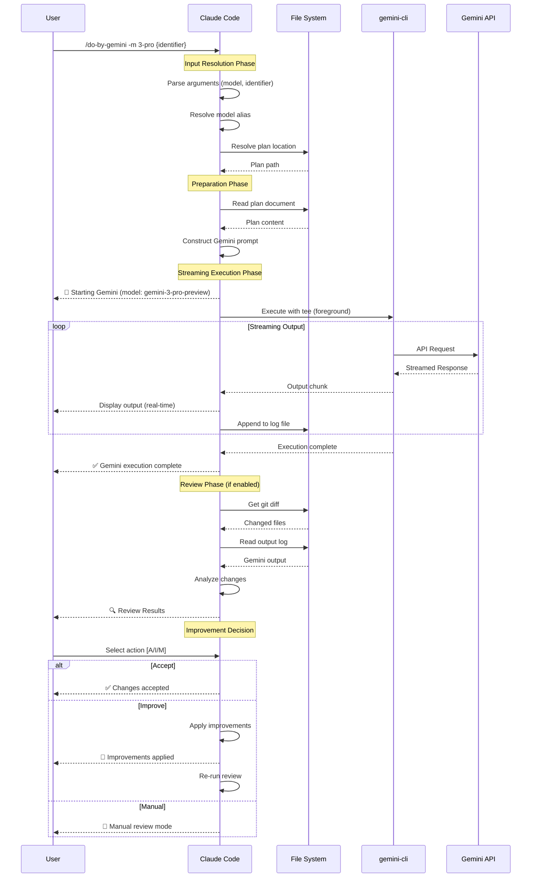
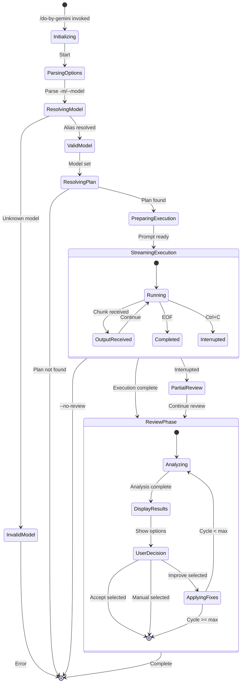
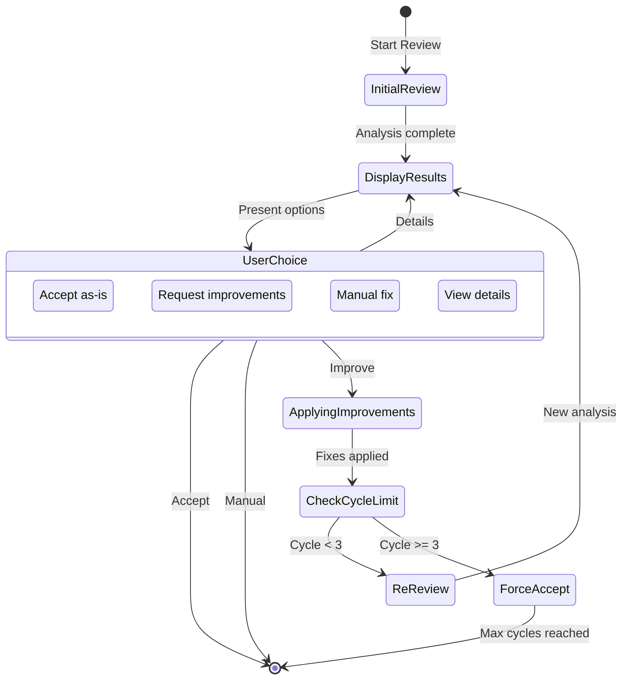

# Specification: Gemini Streaming and Review Integration

## 1. Overview

### 1.1 Purpose

既存の `/do-by-gemini` コマンドを拡張し、以下の3つの主要機能を提供する:

1. **リアルタイム可視性** - Gemini 実行中の出力をストリーミング表示
2. **インタラクティブレビュー** - 実行完了後の Claude Code による自動レビュー
3. **モデル選択** - Gemini モデル（gemini-2.5-pro, gemini-3-pro-preview 等）の選択サポート

### 1.2 Scope

| In Scope | Out of Scope |
|----------|--------------|
| Gemini 出力のリアルタイムストリーミング | Gemini API の直接呼び出し（CLI 経由のみ） |
| 実行後の自動 `/review` 連携 | 構造化出力（JSON モード）のサポート |
| インタラクティブな改善サイクル | Gemini と Claude のハイブリッド実行 |
| `-m` / `--model` フラグによるモデル選択 | グローバル設定ファイルでのモデル設定 |
| モデルエイリアス（`3-pro` → `gemini-3-pro-preview`） | カスタムモデルの追加 |

### 1.3 References

- Research Document: `docs/research/20260121-gemini-streaming-review.md`
- Base Specification: `docs/specs/20260121-do-by-gemini.md`
- Related Command: `commands/do-by-gemini.md`
- Review Command: `commands/review.md`

---

## 2. User Stories

### US-001: リアルタイム出力ストリーミング
**As a** 開発者
**I want** Gemini の実行出力をリアルタイムで確認したい
**So that** 実行状況を把握し、問題があれば早期に介入できる

**Acceptance Criteria:**
- [ ] AC-001: Gemini 実行中に出力がリアルタイムで画面に表示される
- [ ] AC-002: ファイル作成・変更時に進捗インジケータが表示される
- [ ] AC-003: 出力が見やすくフォーマットされている（圧倒的にならない）
- [ ] AC-004: 出力全体がレビュー用にログファイルに保存される

### US-002: 実行後自動レビュー
**As a** 開発者
**I want** Gemini の実行完了後に自動的にコードレビューを受けたい
**So that** 生成されたコードの品質を確認し、改善点を把握できる

**Acceptance Criteria:**
- [ ] AC-001: Gemini 実行完了後に自動的に Claude によるレビューが開始される
- [ ] AC-002: レビュー結果が「Pass」「Warning」「Issue」に分類されて表示される
- [ ] AC-003: 各指摘事項に対して具体的な改善提案が含まれる
- [ ] AC-004: レビューをスキップするオプション（`--no-review`）が利用可能

### US-003: インタラクティブ改善サイクル
**As a** 開発者
**I want** レビュー結果に基づいて改善を適用するか選択したい
**So that** 手動修正と自動修正を使い分けられる

**Acceptance Criteria:**
- [ ] AC-001: レビュー完了後に「Accept」「Improve」「Manual」の選択肢が提示される
- [ ] AC-002: 「Improve」選択時に Claude が自動的に改善を適用する
- [ ] AC-003: 改善適用後に再レビューが実行される
- [ ] AC-004: 改善サイクルは最大3回まで（無限ループ防止）

### US-004: モデル選択
**As a** 開発者
**I want** 使用する Gemini モデルを指定したい
**So that** 最新モデルや用途に適したモデルを選択できる

**Acceptance Criteria:**
- [ ] AC-001: `-m` または `--model` フラグでモデルを指定できる
- [ ] AC-002: デフォルトは `gemini-2.5-pro` が使用される
- [ ] AC-003: モデルエイリアス（`3-pro` → `gemini-3-pro-preview`）が機能する
- [ ] AC-004: 実行開始時に選択されたモデルが表示される
- [ ] AC-005: 無効なモデル指定時に適切なエラーメッセージが表示される

### US-005: 実行中断サポート
**As a** 開発者
**I want** Gemini の実行を中断できるようにしたい
**So that** 問題が発生した場合に早期に停止できる

**Acceptance Criteria:**
- [ ] AC-001: `Ctrl+C` で実行を中断できる
- [ ] AC-002: 中断時に部分的な変更の状態が報告される
- [ ] AC-003: 中断後でも既存の変更に対してレビューを実行できる

---

## 3. Command Interface

### 3.1 Enhanced Command Syntax

#### `/do-by-gemini [-m model] [--no-review] {identifier}`

**Description:** 指定された Plan を Gemini で実行し、オプションで自動レビューを行う

**Arguments:**
```
{identifier} - Plan の識別子（必須）
  - 単純識別子: `20260121-user-auth`
  - プレフィックス付き: `feature:user-auth`, `fix:login-bug`
```

**Options:**
| Flag | Short | Description | Default |
|------|-------|-------------|---------|
| `--model` | `-m` | 使用する Gemini モデル | `gemini-2.5-pro` |
| `--no-review` | - | 自動レビューをスキップ | `false` |

**Examples:**
```bash
# デフォルトモデル（gemini-2.5-pro）で実行
/do-by-gemini user-auth

# Gemini 3 Pro で実行
/do-by-gemini -m 3-pro user-auth
/do-by-gemini --model gemini-3-pro-preview user-auth

# レビューをスキップ
/do-by-gemini --no-review user-auth

# 組み合わせ
/do-by-gemini -m 3-pro --no-review feature:user-auth
```

### 3.2 Model Aliases

| Alias | Resolves To |
|-------|-------------|
| `2.5` | `gemini-2.5-pro` |
| `2.5-pro` | `gemini-2.5-pro` |
| `3` | `gemini-3-pro-preview` |
| `3-pro` | `gemini-3-pro-preview` |

### 3.3 Gemini CLI Invocation

**Enhanced Command Pattern:**
```bash
gemini [-m {model}] -p "{constructed_prompt}" -y 2>&1 | tee /tmp/gemini-output-{timestamp}.log
```

**Flags Used:**
| Flag | Purpose |
|------|---------|
| `-m` | モデル指定（オプション） |
| `-p` | プロンプト入力 |
| `-y` | YOLO モード（自動承認） |

---

## 4. Data Models

### 4.1 Entity: StreamingConfig

| Field | Type | Required | Description |
|-------|------|----------|-------------|
| enabled | boolean | Yes | ストリーミング有効フラグ |
| outputLogPath | string | Yes | 出力ログファイルパス |
| bufferSize | number | No | 出力バッファサイズ |

### 4.2 Entity: ModelConfig

| Field | Type | Required | Description |
|-------|------|----------|-------------|
| modelId | string | Yes | Gemini モデル ID |
| alias | string | No | モデルエイリアス |
| isPreview | boolean | No | プレビュー版フラグ |

### 4.3 Entity: ReviewResult

| Field | Type | Required | Description |
|-------|------|----------|-------------|
| passCount | number | Yes | 問題なしの項目数 |
| warningCount | number | Yes | 警告の項目数 |
| issueCount | number | Yes | 問題の項目数 |
| items | ReviewItem[] | Yes | 個別のレビュー項目 |
| summary | string | Yes | レビュー要約 |

### 4.4 Entity: ReviewItem

| Field | Type | Required | Description |
|-------|------|----------|-------------|
| severity | enum | Yes | pass \| warning \| issue |
| category | string | Yes | security \| performance \| style \| logic |
| message | string | Yes | 指摘内容 |
| location | string | No | ファイルパス:行番号 |
| suggestion | string | No | 改善提案 |

### 4.5 Entity: ImprovementCycle

| Field | Type | Required | Description |
|-------|------|----------|-------------|
| cycleNumber | number | Yes | 現在のサイクル番号（1-3） |
| maxCycles | number | Yes | 最大サイクル数（デフォルト3） |
| appliedFixes | string[] | Yes | 適用された修正のリスト |
| remainingIssues | ReviewItem[] | Yes | 未解決の問題 |

---

## 5. System Flow

### 5.1 Main Execution Flow with Streaming and Review



### 5.2 State Diagram - Enhanced Execution States



### 5.3 Review Cycle State Diagram



---

## 6. Edge Cases & Error Handling

| Scenario | Expected Behavior | Error Message |
|----------|-------------------|---------------|
| 無効なモデル指定 | エラー表示、利用可能モデル一覧を表示 | `❌ Unknown model: '{model}'. Available: gemini-2.5-pro, gemini-3-pro-preview` |
| モデルが利用不可 | フォールバック提案 | `⚠️ Model '{model}' unavailable. Fallback to gemini-2.5-pro? [Y/n]` |
| ストリーミング中断 | 部分的な変更を報告 | `⏹️ Execution interrupted. {n} files were modified.` |
| 大量の出力 | 要約表示 | `📊 Output truncated. Full log: /tmp/gemini-output-{timestamp}.log` |
| レビュー改善ループ上限 | 強制終了 | `🔄 Max improvement cycles (3) reached. Please review manually.` |
| Git リポジトリ外 | diff スキップ | `⚠️ Not a git repository. Skipping diff-based review.` |
| プレビューモデル使用 | 警告表示 | `⚠️ Using preview model. Results may be unstable.` |

---

## 7. Security Considerations

### 7.1 Authentication
- Gemini API 認証は `gemini-cli` の設定に依存
- 追加の認証処理は不要

### 7.2 Authorization
- ファイルシステムアクセスは Claude Code の権限に従う
- Gemini は YOLO モードで動作するため、全アクションが自動承認される

### 7.3 Data Protection
- 出力ログは `/tmp` に保存（セッション終了時に自動削除対象）
- 機密情報を含む Plan の実行時は出力ログの取り扱いに注意
- プレビューモデル使用時のデータ取り扱いに関する警告を表示

---

## 8. Performance Requirements

| Metric | Target | Measurement Method |
|--------|--------|--------------------|
| ストリーミング遅延 | < 1秒 | 出力チャンク受信から表示まで |
| モデル解決時間 | < 10ms | エイリアス解決処理 |
| レビュー開始時間 | < 3秒 | 実行完了からレビュー開始まで |
| メモリ使用量 | < 100MB | 長時間実行時のログバッファ |
| デフォルトタイムアウト | 10分 | Bash timeout parameter |

---

## 9. UI/UX Design

### 9.1 Streaming Output Format

```
┌──────────────────────────────────────────────────────────────────┐
│ 🚀 Starting Gemini Execution                                     │
│ 📄 Plan: docs/plans/features/user-auth.md                        │
│ 🤖 Executor: gemini-cli (YOLO mode)                              │
│ 🧠 Model: gemini-3-pro-preview                                   │
└──────────────────────────────────────────────────────────────────┘

[Gemini] Reading plan...
[Gemini] Creating src/components/UserAuth.tsx...
[Gemini] Writing authentication logic...
[Gemini] Creating tests...
[Gemini] Running verification...

✅ Gemini execution complete
```

### 9.2 Review Results Format

```
┌──────────────────────────────────────────────────────────────────┐
│ 🔍 Claude Code Review                                            │
│                                                                  │
│ Analyzing changes made by Gemini...                              │
│                                                                  │
│ ✅ Pass: 15 items                                                │
│ ⚠️ Warnings: 3 items                                             │
│   - Missing error boundary in UserAuth.tsx:42                    │
│   - Consider adding input validation in login handler            │
│   - Test coverage could be improved for edge cases               │
│ ❌ Issues: 1 item                                                │
│   - Security: Password not hashed before storage                 │
│                                                                  │
│ [A] Accept as-is  [I] Improve  [M] Manual fix  [D] Details       │
└──────────────────────────────────────────────────────────────────┘
```

### 9.3 Improvement Progress Format

```
┌──────────────────────────────────────────────────────────────────┐
│ 🔧 Applying Improvements (Cycle 1/3)                             │
│                                                                  │
│ ✓ Adding error boundary to UserAuth.tsx                          │
│ ✓ Implementing password hashing                                  │
│ → Adding input validation...                                     │
│                                                                  │
│ Re-running review...                                             │
└──────────────────────────────────────────────────────────────────┘
```

---

## 10. File Structure

### 10.1 Modified Files

```
commands/do-by-gemini.md      # Update: add -m flag, --no-review flag
prompts/9_do_by_gemini.md     # Update: streaming + review integration
```

### 10.2 New Files

```
prompts/templates/gemini-review.md    # Review template for Gemini output
```

---

## 11. Testing Strategy

### 11.1 Unit Tests
- モデルエイリアス解決のテスト
- オプション解析のテスト（-m, --model, --no-review）
- レビュー結果パース処理のテスト
- 改善サイクルカウントのテスト

### 11.2 Integration Tests
- ストリーミング出力のキャプチャテスト
- ログファイル書き込みのテスト
- Git diff 取得のテスト
- レビュー→改善フローのテスト

### 11.3 E2E Tests
- デフォルトモデルでの実行テスト
- 明示的モデル指定での実行テスト
- 自動レビュー→改善サイクルのテスト
- 中断シナリオのテスト
- `--no-review` オプションのテスト

---

## 12. Open Items

- [ ] レビューの深さ設定（quick check vs thorough）の詳細仕様
- [ ] グローバル設定ファイルでのデフォルトモデル設定
- [ ] 部分成功時（一部ファイル OK、一部問題あり）の取り扱い詳細
- [ ] Gemini 構造化出力（JSON モード）の将来サポート検討
- [ ] 改善実行者の選択（Claude vs Gemini）の設定オプション

---

**Created:** 2026-01-21
**Last Updated:** 2026-01-21
**Status:** Draft
**Author:** Claude Code
