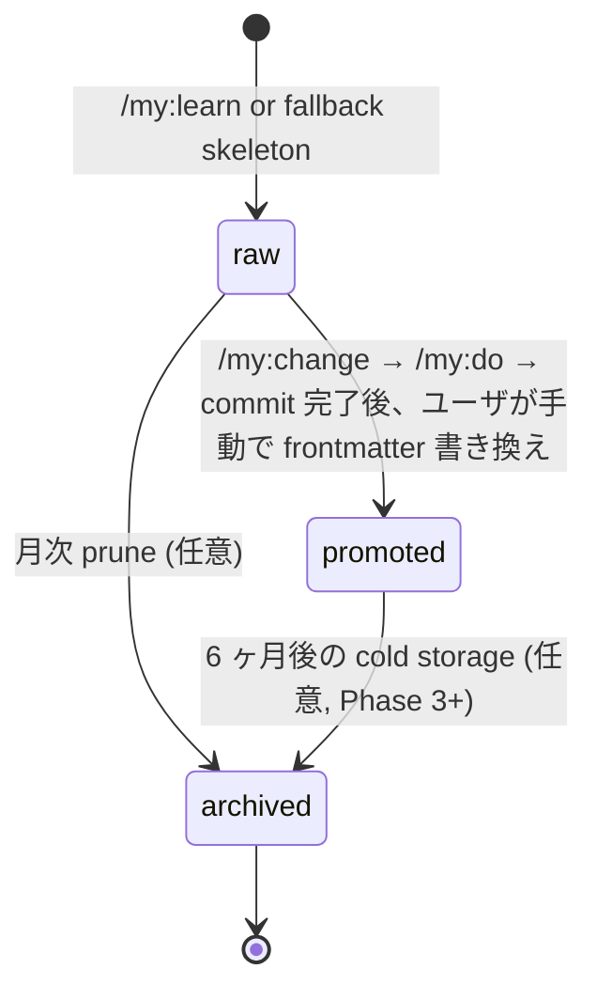
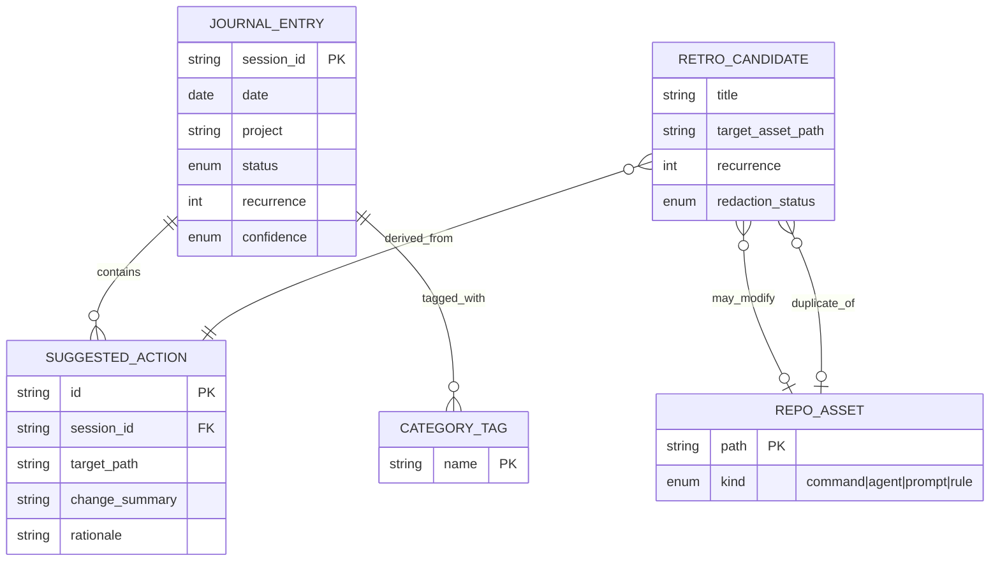
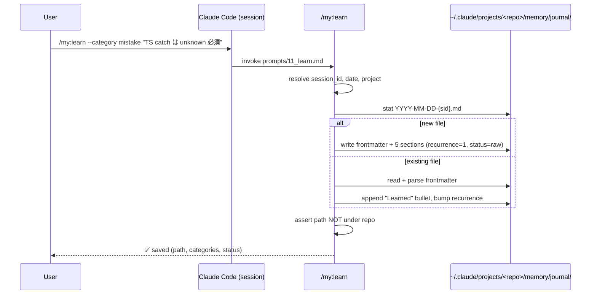
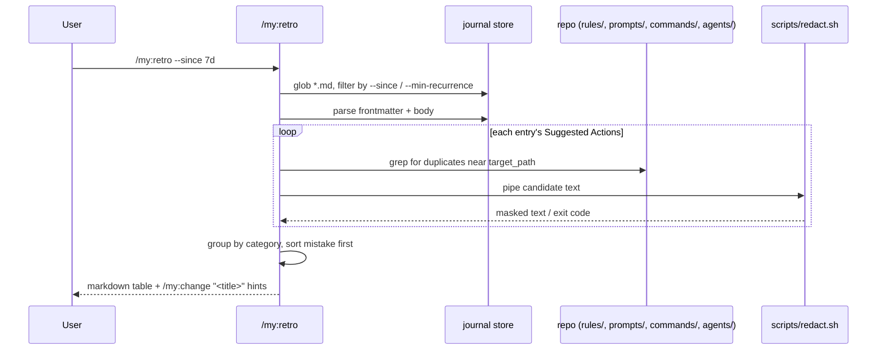
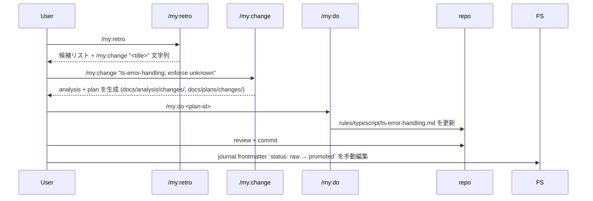

# Specification: Session Knowledge Capture & Asset Self-Improvement (MVP)

## 1. Overview

Claude Code セッションで得られた知見 (学び・失敗・パターン) を
machine-local の journal に蓄積し、人手レビューを経て本リポジトリの
既存アセット (`commands/`, `agents/`, `prompts/`, `rules/`) へ
昇格させる仕組みを導入する。MVP はリポジトリにコミットする
2 つの slash command (`/my:learn`, `/my:retro`) と journal スキーマ定義のみで
構成され、Hooks や LLM 要約は段階導入とする。

### 1.1 Purpose

- セッションをまたぐ知見の揮発を止め、同じ訂正を繰り返さない開発体験にする。
- 知見 → アセット改善のループを「気が向いたら」から「proposal-then-approval」の
  構造化された SDD パイプラインに乗せる。
- 本リポジトリの提供価値を「静的テンプレ」から「使うほど鋭くなる開発支援基盤」へ昇格させる。

### 1.2 Scope

| In Scope (MVP / Phase 1) | Out of Scope (MVP) |
|--------------------------|--------------------|
| `/my:learn` slash command (会話中の手動キャプチャ) | SessionEnd / SessionStart / PreCompact hooks の自動設定 (Phase 2) |
| `/my:retro` slash command (昇格候補の提案・diff 出力のみ) | hook 内 LLM 要約 (`claude -p` 自動 spawn) (Phase 3+) |
| Journal canonical schema (YAML frontmatter + 5 body sections) | `learner` / `retrospector` を独立 subagent として実装 (Phase 3) |
| Machine-local journal store (`~/.claude/projects/<repo>/memory/journal/`) | リポジトリ内 `docs/journal/` ディレクトリの新設 (構造的に作らない) |
| `docs/examples/journal-entry-example.md` (テンプレ例) と `.gitignore.journal-template` (リポジトリ内 `docs/journal/` は作らない — US-003 invariant) | 外部 SaaS / バイナリ DB / ベクトル DB |
| `/my:retro` → `/my:change` 受け渡し (`cd <toolkit_repo> && /my:change "..."` 形式の手動ハンドオフ文字列, §3.5) | `/my:retro` から `/my:change` への自動連携 (Phase 3) |
| Toolkit repo の自動解決 (`~/.claude/commands` symlink 経由, §3.5) | toolkit repo パスの GUI / 対話的設定 (Phase 2) |
| category taxonomy 5 種 (`mistake / pattern / preference / domain-knowledge / open-question`) | category 自動分類 (Phase 3+) |
| `scripts/redact.sh` 仕様 (本 spec では interface のみ、実装は plan で詳細化) | binary scanner / 高度 secret detector |
| Promotion 判定: **手動** (`/my:retro` レビューで人が選ぶ, Q3=(b)) | recurrence 自動昇格 (Phase 3+) |
| Auto Memory との共存 (MEMORY.md 直接編集はしない) | Auto Memory のスキーマ拡張 |

### 1.3 References

- Research Document: `docs/research/20260627-session-knowledge-capture.md`
- Existing pipeline command: `commands/my/pipeline.md`
- Existing change flow: `commands/my/change.md`, `agents/changer.md`
- Existing pattern (prompt 構造の参考): `prompts/1_research.md`, `prompts/6_change.md`
- Open questions resolved in research: Q1 (machine-local), Q2 (skeleton-only MVP), Q4 (existing assets)

---

## 2. User Stories

### US-001: セッション中に手動で知見を記録する
**As a** Claude Code ユーザ (本リポジトリ所有者)
**I want** 会話の任意のタイミングで `/my:learn` を実行して知見を journal に追記する
**So that** セッション終端を待たず、忘れる前に学びを永続化できる

**Acceptance Criteria:**
- [ ] AC-001: `/my:learn` 実行時、引数なしでも現在のセッションコンテキストから
      canonical schema (§4.1) に沿った markdown が `~/.claude/projects/<repo>/memory/journal/YYYY-MM-DD-{session_id}.md` に追記される。
- [ ] AC-002: 引数 (`/my:learn <free-text memo>`) を渡した場合は `Learned` セクションに反映される。
- [ ] AC-003: 同一 session_id のファイルが既に存在する場合、新規ファイルは作らず
      既存ファイルの末尾に追記される (冪等性 NFR-003)。
- [ ] AC-004: journal 保存パスがリポジトリ内 (`docs/journal/` 等) ではないことを実行時に検証し、
      もしリポジトリ内なら abort してエラーメッセージを返す。
- [ ] AC-005: 出力する markdown は frontmatter (`session_id / date / project / categories /
      confidence / recurrence / status: raw`) と 5 body sections を必ず含む。

### US-002: 蓄積した journal から昇格候補を提案させる
**As a** Claude Code ユーザ
**I want** `/my:retro [--since 7d]` で過去の journal を走査し、昇格候補を一覧で受け取る
**So that** 散在する知見の中から「`rules/` / `prompts/` / `commands/` に反映すべきもの」を選別できる

**Acceptance Criteria:**
- [ ] AC-001: `/my:retro` は `~/.claude/projects/<repo>/memory/journal/` 配下を Glob 走査する。
- [ ] AC-002: `--since` オプション (`7d` / `30d` / `YYYY-MM-DD`) で期間絞り込みできる。
      省略時は直近 14 日。
- [ ] AC-003: 出力は markdown table 形式で、列は
      `候補タイトル / target asset path / change summary / rationale (出典 journal リンク)`。
- [ ] AC-004: 各候補に対し、次に実行すべき `/my:change "<候補タイトル>"` コマンド文字列を提示する。
      apply は行わない (FR-006 / 8.5 proposal-then-approval 厳守)。
- [ ] AC-005: 既存の `rules/`, `prompts/`, `commands/`, `agents/` を grep し、
      重複候補は `(duplicate of <path>)` マークを付ける。
- [ ] AC-006: 出力前に `scripts/redact.sh` (§3.3) を通し、検出された秘匿パターンがあれば
      該当エントリを候補から除外し、stderr に warning を出す。

### US-003: 個人 journal をリポジトリへ誤コミットさせない
**As a** 本リポジトリの所有者・将来の利用者
**I want** journal が構造的に machine-local にしか存在しないことを保証する
**So that** プライバシー・秘匿情報がリポジトリに混入するリスクを設計で排除できる

**Acceptance Criteria:**
- [ ] AC-001: リポジトリには `docs/journal/` ディレクトリ自体を作らない。
      作るのは `docs/journal/EXAMPLE.md` ではなく、`docs/examples/journal-entry-example.md` (リポジトリ内に置けるサンプル) のみ。
- [ ] AC-002: `/my:learn` / `/my:retro` は journal の write/read パスとして
      `~/.claude/projects/<repo>/memory/journal/` のみを許可する (§3.1 path policy)。
- [ ] AC-003: `.gitignore` テンプレ (`.gitignore.journal-template`) を repo に置き、
      利用者が `cat ... >> .gitignore` で追記する手順を README で案内する
      (リポジトリ内に journal を置く運用を選んだ将来の利用者向けの保険)。

### US-004: 昇格判定を SDD パイプラインに乗せる
**As a** Claude Code ユーザ
**I want** `/my:retro` の候補から選んだ 1 件を `/my:change` 経由で既存アセットに反映する
**So that** 改修の痕跡が `docs/analysis/changes/` と `docs/plans/changes/` に残り、レビュー可能になる

**Acceptance Criteria:**
- [ ] AC-001: `/my:retro` の候補出力には、コピー&ペーストで使える「**cd 込み**」コマンド文字列が併記される。
      形式: `cd <toolkit_repo> && /my:change "<title>"`。
      `<toolkit_repo>` は §3.5 の Toolkit Repository Resolution に従って解決する。
- [ ] AC-002: `/my:change` 側には変更を加えない (既存 changer agent は無修正で動くこと)。
- [ ] AC-003: 昇格に成功した journal entry は手動で `status: promoted` に書き換える運用とし、
      自動更新は行わない (MVP)。書き換え手順は `/my:retro` の出力末尾にガイドとして表示する。
- [ ] AC-004: `<toolkit_repo>` が解決できない (symlink 不在等) 場合は、絶対パスのプレースホルダ
      `<TOOLKIT_REPO>` を出し、出力末尾に「~/.claude/commands を toolkit repo に symlink するか、`<TOOLKIT_REPO>` を手で置き換えてから実行してください」のガイドを追加する。
      cwd を toolkit repo として誤推測して出力することは **禁止** (cwd の `.claude` 配下に成果物が漏れる事故を防ぐため)。

### US-005: category taxonomy で知見を分類する
**As a** journal を後から読み返すユーザ
**I want** 各 entry に category タグが付き、`/my:retro` がカテゴリ別に整理する
**So that** "mistake" を最優先に昇格レビューできる

**Acceptance Criteria:**
- [ ] AC-001: frontmatter `categories` には `mistake / pattern / preference / domain-knowledge / open-question` の
      列挙のみ許可する (Q8 解決, MVP 5 種)。
- [ ] AC-002: `/my:learn` は会話文脈から categories を推定するが、ユーザが
      `/my:learn --category mistake "..."` で明示指定もできる。
- [ ] AC-003: `/my:retro` は出力を category 別 H3 セクションに分け、`mistake` を先頭にソートする。

---

## 3. Interface (Slash Commands & Schemas)

> 注: 本機能はネットワーク API ではなく、slash command と markdown ファイル群で完結する。
> このセクションでは API の代わりに「コマンド契約」「ファイルパス契約」「スクリプト契約」を仕様化する。

### 3.1 Slash Command: `/my:learn`

**Definition file:** `commands/my/learn.md`
**Backing prompt:** `prompts/11_learn.md`
**Backing subagent (MVP では agent 分離は任意, Phase 3 で正式分離):** 直接 prompt から実装

**Invocation:**
```
/my:learn [--category <cat>] [--confidence high|medium|low] [<free-text memo>]
```

**Arguments:**
| Arg | Type | Required | Description |
|-----|------|----------|-------------|
| `--category` | `mistake \| pattern \| preference \| domain-knowledge \| open-question` | No | 省略時は会話文脈から推定 |
| `--confidence` | `high \| medium \| low` | No | 省略時は `medium` |
| free-text memo | string | No | `Learned` セクション本文の seed |

**Behavior (sequence):**
1. 現在の session_id を取得する。MVP の取得順序:
   1. 環境変数 `$CLAUDE_SESSION_ID` (Claude Code が公開する場合) を優先採用。
   2. 未設定なら `transcript_path` 環境変数 (もしくはツール経由で渡される `transcript_path` 値) のファイル名 stem (拡張子を除いた basename) を session_id とみなす。例: `~/.claude/projects/<repo>/transcripts/7a063d83-…json` → `7a063d83-…`。
   3. いずれも取得できない場合は Edge case #2 の timestamp fallback (`mv-YYYYMMDD-HHMMSS`) を使用。
2. 保存先パスを構築 — `~/.claude/projects/<repo>/memory/journal/YYYY-MM-DD-{session_id}.md` (`<repo>` の定義は §3.4 参照)。
3. ファイルが存在しなければ §4.1 schema で新規作成。存在すれば追記モードで開く。
4. frontmatter を upsert (既存 entry なら `recurrence` を +1、無ければ `recurrence: 1`)。MVP では同一 journal ファイル (= 同一 session_id) への `/my:learn` 呼び出し回数をそのままカウントする (=「capture count within session」)。テーマ単位の重複判定 (body の `Learned` bullet を比較してマージする) は Phase 3 で導入予定。
5. body 5 sections を埋める (memo, conversation context から抽出)。
6. ファイルを書き出し、stdout に「saved to: <path>」「next step: `/my:retro` で昇格候補を確認」と表示。

**Output (stdout):**
```
✅ Journal entry appended.
Path: ~/.claude/projects/custom-slash-command/memory/journal/2026-06-27-7a063d83.md
Categories: [mistake]
Status: raw
Next: run `/my:retro` to see promotion candidates.
```

**Error responses:**
| Condition | Behavior |
|-----------|----------|
| 保存先が repo 配下に解決された | abort, stderr に "journal path must be machine-local" を出力, exit 1 |
| session_id が取得できない | fallback として timestamp ベースの id を生成し warning を出す |
| frontmatter のパースに失敗 (既存ファイル破損) | バックアップ (`*.bak`) を作って新規ファイル化, warning |

---

### 3.2 Slash Command: `/my:retro`

**Definition file:** `commands/my/retro.md`
**Backing prompt:** `prompts/12_retro.md`

**Invocation:**
```
/my:retro [--since 7d|30d|YYYY-MM-DD] [--category <cat>] [--min-recurrence N]
```

**Arguments:**
| Arg | Type | Required | Default | Description |
|-----|------|----------|---------|-------------|
| `--since` | duration or date | No | `14d` | 走査対象の下限日付 |
| `--category` | category enum | No | (all) | 特定 category のみ表示 |
| `--min-recurrence` | integer | No | `1` | frontmatter の `recurrence` (capture count within session) しきい値。例: `--min-recurrence 2` を指定すると `recurrence: 1` の entry は除外される |

**Behavior (sequence):**
1. `~/.claude/projects/<repo>/memory/journal/` を Glob で列挙。
2. frontmatter を parse し、`--since` 以降かつ `--min-recurrence` 以上の entry を抽出。
3. 各 entry の `Suggested Actions` セクションを収集。なければ `Learned` から候補を生成。
4. **toolkit repository を §3.5 に従って解決** (`<toolkit_repo>` を確定)。解決できない場合は AC-004 のフォールバックに従う。
5. 候補ごとに **`<toolkit_repo>` 配下** (`<toolkit_repo>/rules/`, `<toolkit_repo>/prompts/`, `<toolkit_repo>/commands/`, `<toolkit_repo>/agents/`) を grep し、
   既存ファイルの近傍テキストを `(possible duplicate of <path>)` として注記。
   **cwd 配下の grep は行わない** (cwd は任意のプロジェクトであり、toolkit ではない)。
6. `scripts/redact.sh` を全候補テキストに適用。MVP の disposition ルール:
   - `redact.sh` exit 0 (clean) → `redaction_status: clean`、候補を出力に含める。
   - `redact.sh` exit 2 (matches found) → MVP では一律 `redaction_status: excluded` とし、候補を出力から **除外** する。`masked` 状態 (検出はあるが安全に置換できたとして表示する) は Phase 2 で path 置換等のクラスだけ限定的に解禁する。
   - stderr に excluded count / cleaned count を出力。
7. category 別 H3 セクションに整形して stdout に表示。`mistake` を先頭にソート。
8. 各候補末尾に **cd 込みのコピペ用コマンド** を出す:
   `cd <toolkit_repo> && /my:change "<title>"`。
   `<toolkit_repo>` 解決失敗時は `cd <TOOLKIT_REPO> && /my:change "<title>"` (プレースホルダ) を出し、出力末尾に置換ガイドを追加する (US-004 AC-004)。
9. 最後に「promotion 後は journal frontmatter の `status` を手動で `promoted` に変更してください」のガイドを出す。

**Output (stdout, abridged) — toolkit repo が解決できた場合:**
```
# Retrospective: last 14 days (12 entries scanned)
Toolkit repo: /Users/naoki/src/github.com/naoking158/custom-slash-command

## mistake (3 candidates)

### M1. "TypeScript の error union 型を `unknown` で受けない"
- Source: 2026-06-20-3f4b.md, 2026-06-25-7a06.md (recurrence: 2)
- Target asset: rules/typescript/ts-error-handling.md (possible duplicate of rules/typescript/ts-strict-null.md)
- Change summary: "error catch 句に `unknown` 型注釈を明示する例を追記"
- Next:
    cd /Users/naoki/src/github.com/naoking158/custom-slash-command \
      && /my:change "ts-error-handling: enforce unknown in catch"

## pattern (5 candidates)
...

---
Tip 1: 上記コマンドは **必ず cd 込みで実行** してください。cwd のまま `/my:change` を実行すると、現在のプロジェクト配下に `docs/analysis/changes/` 等が作られ、toolkit への変更が散逸します。
Tip 2: 昇格に成功した journal は frontmatter の `status: raw` を `status: promoted` に手動で書き換えてください。
```

**Output (stdout, abridged) — toolkit repo が解決できなかった場合 (US-004 AC-004):**
```
# Retrospective: last 14 days (12 entries scanned)
Toolkit repo: <TOOLKIT_REPO>  (⚠️ 自動解決に失敗)

...

- Next:
    cd <TOOLKIT_REPO> \
      && /my:change "ts-error-handling: enforce unknown in catch"

---
⚠️ Toolkit repo の自動解決に失敗しました。
次のいずれかで対処してください:
  1. `ln -s <あなたの custom-slash-command 絶対パス>/commands ~/.claude/commands` で symlink を張る
  2. 上記コマンドの `<TOOLKIT_REPO>` を手で置き換える
cwd を toolkit と推測して置換することは行いません (US-004 AC-004)。
```

**Error responses:**
| Condition | Behavior |
|-----------|----------|
| journal ディレクトリが存在しない | "No journal entries found at <path>. Run `/my:learn` first." を出して exit 0 |
| `scripts/redact.sh` が見つからない | stderr に warning, redaction なしで続行 (将来 Phase 2 で strict mode に切替) |
| `--since` のパース失敗 | exit 1 と usage を出力 |

---

### 3.3 Script: `scripts/redact.sh`

**Path:** `scripts/redact.sh` (リポジトリ内, executable)
**Invocation:** `scripts/redact.sh <input-file-or-stdin>` → masked text to stdout, exit code = 0 (clean) / 2 (matches found and masked) / 1 (error)

**Patterns to detect (MVP):**
1. API key prefixes: `sk-[A-Za-z0-9]{20,}`, `ghp_[A-Za-z0-9]{30,}`, `AKIA[A-Z0-9]{16}`
2. Absolute home paths: `/Users/<name>/...` → 置換 `$HOME/...`
3. `.env` style RHS: lines matching `*_TOKEN=`, `*_SECRET=`, `*_KEY=` の右辺をマスク
4. 8 桁以上連続英数字でユーザ定義 deny-list (`scripts/redact.denylist`) と一致するもの

**Out of scope (MVP):** PII detection, hex blob inspection, binary scanning.

---

### 3.4 File Path Contract (binding decision from Q1 / Constraint 1)

| Logical store | Physical path | Repo-tracked? |
|---------------|---------------|---------------|
| Raw journal entries | `~/.claude/projects/<repo>/memory/journal/YYYY-MM-DD-{session_id}.md` | No (machine-local) |
| MEMORY.md (Auto Memory shared) | `~/.claude/projects/<repo>/memory/MEMORY.md` | No |
| Journal schema spec | `docs/specs/20260627-session-knowledge-capture.md` (本書) | Yes |
| Journal example | `docs/examples/journal-entry-example.md` | Yes |
| `.gitignore` template | `.gitignore.journal-template` (repo root) | Yes |
| Slash command definitions | `commands/my/learn.md`, `commands/my/retro.md` | Yes |
| Backing prompts | `prompts/11_learn.md`, `prompts/12_retro.md` | Yes |
| Redaction script | `scripts/redact.sh`, `scripts/redact.denylist` | Yes |

**`<repo>` 識別子の MVP 正規化ルール:** `<repo> = basename "$PWD"` をそのまま使用し、追加のサニタイズは行わない (例: `custom-slash-command`)。`/` を含む値が出現するケースは MVP では想定外とし、Phase 2 で正規化ロジックを再検討する。本書中で参照される `<repo>` / `<repo-sanitized>` はすべてこの定義に従う。

**書き込み許可パス (Auto Memory との非干渉):** `/my:learn` / `/my:retro` の write/read 対象は `~/.claude/projects/<repo>/memory/journal/` 配下に限定する。同階層の `MEMORY.md` および兄弟ファイル (Auto Memory が管理) は read-only として一切 mutate しない。

**`<toolkit_repo>` (custom-slash-command の絶対パス):** §3.5 の Toolkit Repository Resolution で解決する。`<repo>` (= 現在の作業ディレクトリ名) と `<toolkit_repo>` は **明確に別概念**。`/my:retro` は両者を取り違えないこと。

**Invariant (US-003 backing):** `<repo>/docs/journal/` ディレクトリは作らない。
作成試行は CI / lint で検知できるよう、Phase 2 で `.github/` チェックの追加を検討する (out of MVP scope).

---

### 3.5 Toolkit Repository Resolution (binding decision — supports US-004 AC-001 / AC-004)

`/my:retro` は **toolkit repository** (= 本リポジトリ `custom-slash-command` のクローンが置かれている絶対パス) を解決する必要がある。これは:

1. 候補の重複 grep 対象を toolkit repo 配下に限定するため (§3.2 step 5)
2. ユーザに `cd <toolkit_repo> && /my:change "..."` の形式で安全なコマンドを提示するため (§3.2 step 8)

**MVP 解決アルゴリズム (priority order):**

| # | 方法 | 検出条件 | 戻り値 |
|---|------|----------|--------|
| 1 | symlink 経由 (推奨) | `~/.claude/commands` が symlink で、ターゲットが `*/commands` で終わる | `dirname $(readlink ~/.claude/commands)` |
| 2 | 環境変数 override | `$CLAUDE_TOOLKIT_REPO` が設定されていてディレクトリが存在 | `$CLAUDE_TOOLKIT_REPO` |
| 3 | 解決失敗 | 上記いずれも該当しない | `""` (空文字) → AC-004 のフォールバック動作 |

**禁止事項:**
- cwd (`$PWD`) を toolkit repo と推測することは **禁止**。cwd は任意のプロジェクト (例: `rails-app`) であり、toolkit ではない。
- ホームディレクトリ配下の任意パスを推測することも禁止 (例: `~/src/*/custom-slash-command` の glob 走査はしない)。

**フォールバック動作 (解決失敗時):**
- 出力ヘッダに `Toolkit repo: <TOOLKIT_REPO>  (⚠️ 自動解決に失敗)` を出す。
- 各候補の `cd ... && /my:change` 文字列にプレースホルダ `<TOOLKIT_REPO>` をそのまま埋め込む。
- 出力末尾に置換ガイド (§3.2 Output 例参照) を出す。
- exit code は 0 (解決失敗は致命ではない、ユーザが手動で置換すれば動くため)。
- 重複 grep (§3.2 step 5) は **skip** し、各候補に `(duplicate check skipped: toolkit repo not resolved)` を注記する。

---

## 4. Data Models

### 4.1 Entity: JournalEntry

ファイル名: `YYYY-MM-DD-{session_id}.md`
フォーマット: Markdown with YAML frontmatter

**Frontmatter fields:**

| Field | Type | Required | Description |
|-------|------|----------|-------------|
| `session_id` | UUID v4 string | Yes | Claude Code session id (transcript ファイル名と一致) |
| `date` | ISO date `YYYY-MM-DD` | Yes | エントリ作成日 (JST) |
| `project` | string | Yes | repo 名 (例: `custom-slash-command`) |
| `categories` | array of enum | Yes | §4.3 category enum から 1 つ以上 |
| `confidence` | enum `high \| medium \| low` | Yes | 知見の確度 |
| `recurrence` | integer ≥ 1 | Yes | MVP の意味: 同一 session_id への `/my:learn` 呼び出し回数 (capture count within session)。テーマ単位の集計は Phase 3 で導入 |
| `status` | enum `raw \| promoted \| archived` (`proposed` は Phase 3 以降の予約値、MVP では書き込まない) | Yes | ライフサイクル (§4.4) |
| `source_commits` | array of git SHA strings | No | 関連コミット (任意) |
| `tags` | array of string | No | フリーフォームタグ |

**Body sections (順序固定, 全 5 セクション必須):**

1. `## Request` — そのセッションでユーザが依頼したこと (1-3 行)
2. `## Investigated` — 調べたこと / 検討した代替案 (箇条書き可)
3. `## Learned` — **昇格候補の中核**。学びを 1 件 1 行で書く
4. `## Completed` — 成果物 (PR / commit / 生成ファイルへのリンク可)
5. `## Next Steps / Open Threads` — 次セッションへの引継 (なければ "None")
6. (任意) `## Suggested Actions (promotion candidates)` — 構造化された候補。
   各項目は `target / change / rationale` の 3 フィールドを持つ箇条書き。

### 4.2 Entity: RetroCandidate (in-memory only / `/my:retro` 出力時に組み立てる)

| Field | Type | Description |
|-------|------|-------------|
| `title` | string | 候補タイトル (`/my:change` の引数になる) |
| `target_asset_path` | string | 改修対象の repo 内パス |
| `change_summary` | string | 1-2 行の変更要約 |
| `rationale` | string | なぜこの変更が必要か |
| `source_entries` | array of JournalEntry references | 出典 (session_id + 行範囲) |
| `recurrence` | integer | 集計値 |
| `duplicate_of` | string \| null | 既存アセットへの近傍ヒット |
| `redaction_status` | enum `clean \| masked \| excluded` | redact.sh 結果。MVP では `clean` または `excluded` のみが出現し、`masked` は Phase 2 以降で使用する予約値 |

### 4.3 Category Taxonomy (Q8 resolved, MVP)

| Category | 意味 | 典型的な昇格先 |
|----------|------|----------------|
| `mistake` | Claude / 自分の誤り、訂正された内容 | `rules/<lang>/...md`, `CLAUDE.md` |
| `pattern` | 上手くいった解法、再利用したい手順 | `prompts/_shared/*.md`, `commands/my/*.md` |
| `preference` | スタイル・命名・ツール選好 | `CLAUDE.md`, `rules/_shared/preferences.md` |
| `domain-knowledge` | プロジェクト固有の前提知識 | `docs/` または `rules/<domain>/...md` |
| `open-question` | 未解決事項 (research 種) | research artifact のシードに |

### 4.4 State Diagram: JournalEntry status



> Note: `proposed` は Phase 3 以降に `/my:retro` が候補として書き戻す際に使う予約状態。MVP では `/my:retro` は read-only のため遷移を発生させない (§3.2 / US-004 AC-003)。

### 4.5 ER Diagram



---

## 5. System Flow

### 5.1 Sequence Diagram — `/my:learn` の主フロー



### 5.2 Sequence Diagram — `/my:retro` の主フロー



### 5.3 Sequence Diagram — Promotion (人手介在)



---

## 6. Edge Cases & Error Handling

| # | Scenario | Expected Behavior | Exit / Notice |
|---|----------|-------------------|---------------|
| 1 | journal 保存パスを解決した結果、repo 配下になった | abort, ファイル作成しない | exit 1, stderr に "journal must be machine-local: <resolved-path>" |
| 2 | session_id が取得不能 (CI 等で実行) | timestamp ベース fallback id (`mv-YYYYMMDD-HHMMSS`) | exit 0, warning |
| 3 | 既存 journal の frontmatter が破損 | `*.bak` にコピーして新規ファイル化 | exit 0, warning |
| 4 | `~/.claude/projects/<repo>/memory/journal/` ディレクトリが存在しない | `mkdir -p` で作成して続行 | exit 0 |
| 5 | `/my:retro` 実行時 journal が 0 件 | 案内メッセージのみ表示 | exit 0 |
| 6 | `--since` のパース失敗 | usage を出して exit 1 | exit 1 |
| 7 | `scripts/redact.sh` が見つからない | warning を出して redaction なしで続行 | exit 0, warning |
| 8 | `scripts/redact.sh` が exit 2 (matches found) | 該当候補は出力から除外 | candidate.redaction_status = excluded |
| 9 | `--min-recurrence` が負数 / 非数値 | usage を出して exit 1 | exit 1 |
| 10 | category 列挙に未知の値が出現 | warning を出し `domain-knowledge` にフォールバック | exit 0, warning |
| 11 | 同一 session_id で `/my:learn` が複数回呼ばれる | 同一ファイルに追記。`recurrence` は frontmatter の単純加算 (capture count within session) であり、body の bullet 重複検出は行わない (Phase 3 で導入予定) | exit 0 |
| 12 | 既存アセットに完全一致するルールが存在 | 候補に `duplicate_of` を設定し優先度を下げる (sort 時に末尾) | exit 0 |
| 13 | journal ファイルに 5 セクション全てが揃っていない | 欠落セクションを空 body で補完して読み込み続行 | exit 0, warning |
| 14 | hookify plugin の Stop hook と競合 | 本仕組みは Stop hook を使わない (Phase 1)。同名ファイル / パスは避ける | N/A |
| 15 | Auto Memory が MEMORY.md を上書き | 本仕組みは MEMORY.md を直接書かない。journal は別ファイルなので競合しない | N/A |

---

## 7. Security Considerations

### 7.1 Authentication

ローカル CLI ツールのため認証なし。Claude Code 自身のセッション内で動作する。

### 7.2 Authorization

- journal の write/read 権限は実行ユーザの home ディレクトリに閉じる。
- リポジトリ書き込み (`rules/`, `prompts/` 等) は `/my:change` → `/my:do` の既存フロー経由でしか起こさない (FR-006)。
- `/my:retro` は読み取り専用。直接 mutation は禁止。

### 7.3 Data Protection (秘匿情報対策)

| Layer | Mechanism | Reference |
|-------|-----------|-----------|
| **L1 Structural** | journal は machine-local のみ。リポジトリに `docs/journal/` を作らない (US-003 / §3.4) | binding |
| **L2 Procedural** | `scripts/redact.sh` で API キー / 絶対パス / `.env` RHS / deny-list を mask (§3.3) | MVP |
| **L3 Process** | `/my:retro` の出力前に必ず redact.sh を通す。検出ありなら excluded | MVP |
| **L4 User-facing** | README に「journal を repo に push しない」明文 + `.gitignore.journal-template` 配布 | MVP |
| **L5 Pre-commit (任意)** | repo root に `pre-commit` hook 例を置く (journal 命名規約のファイルが staged にあると abort) | Phase 2 |

### 7.4 Threat Model (簡易)

- **脅威**: 秘匿トークン / プロジェクト固有 PII が journal に書き込まれ、誤って push される。
  - 対策: L1 (構造的に repo に置けない) が第一防衛線。L2-L5 は防御縦深。
- **脅威**: `/my:change` を経由せず誰かが `rules/` を勝手に書き換える。
  - 対策: 本仕様は自動 mutation を一切しない。`/my:retro` は read-only。
- **脅威**: hook 故障でセッションが妙な挙動になる。
  - 対策: MVP では hook を使わない。Phase 2 で SessionEnd 採用時は exit 0 強制。
- **脅威**: `/my:retro` が toolkit repo を取り違え、ユーザが cwd のプロジェクト (例: `rails-app`) で `/my:change` を実行してしまい、本来 toolkit に入るべき昇格コミットが任意プロジェクトの `.claude` / `docs/` 配下に作られて散逸する。
  - 対策: §3.5 で cwd 推測を **禁止**。解決失敗時は `<TOOLKIT_REPO>` プレースホルダで明示し、ユーザに置換させる。Tests §9.2 で symlink 不在ケースを検証 (US-004 AC-004)。

---

## 8. Performance Requirements

| Metric | Target | Measurement Method |
|--------|--------|--------------------|
| `/my:learn` 実行時間 (file write 完了まで) | < 500ms (LLM 抽出含まず) | 手動計測 / `time` |
| `/my:retro` 実行時間 (journal 100 件まで) | < 5s | 手動計測 |
| Journal 1 entry サイズ | < 8KB (frontmatter + body) | wc -c |
| 累積 journal サイズ (1 年分想定) | < 50MB | `du -sh ~/.claude/projects/<repo>/memory/journal/` |
| `scripts/redact.sh` 1 候補処理時間 | < 100ms | bench |
| `/my:retro` の Signal/Noise 比 (8.4 KPI) | ≥ 20% | candidates ÷ entries |

非機能: NFR-006 準拠 — Python / Node 追加依存なし。`bash` + `jq` のみ。

---

## 9. Testing Strategy

### 9.1 Unit Tests (shell-level)

- `scripts/redact.sh` のパターン検出を `bats` または shell 駆動テストで網羅:
  - sk-/ghp_/AKIA 各プレフィクスでマスクされること
  - `/Users/<name>/` が `$HOME/` に置換されること
  - deny-list ヒット時の exit code が 2 であること
  - clean input で exit 0 / 出力が入力と同一
- frontmatter parser (jq) の正常系 / 破損系 / 欠損フィールド系

### 9.2 Integration Tests

- `/my:learn` を空状態で起動 → ファイル新規作成 → 同 session で再起動 → 同ファイルに追記 (AC-001/003)
- `/my:learn` を repo 内パスに誤誘導 → abort (AC-004 / Edge case #1)
- `/my:retro` を 0 件状態で起動 → 案内メッセージのみ (Edge case #5)
- `/my:retro` を 3 件 (mistake/pattern/preference 各 1) で起動 → mistake が先頭にソート (AC US-005)
- `/my:retro` 出力に **`cd <toolkit_repo> && /my:change "<title>"` 文字列** が含まれること (US-004 AC-001)
- `/my:retro` を `~/.claude/commands` symlink 不在の状態で起動 → 出力に `<TOOLKIT_REPO>` プレースホルダと置換ガイドが出ること、**cwd で置換されないこと** (US-004 AC-004)
- `/my:retro` を `$CLAUDE_TOOLKIT_REPO` を設定して起動 → そちらが優先されること (§3.5 priority order)

### 9.3 E2E Tests (manual smoke)

- 実セッションで `/my:learn "test entry"` → journal が `~/.claude/projects/custom-slash-command/memory/journal/` に作られる
- 5 件溜めた後 `/my:retro --since 7d` を実行 → 候補リストが表示される
- 候補 1 件を `/my:change` に流し、`docs/analysis/changes/` と `docs/plans/changes/` に痕跡が残ることを確認
- 完了後 journal の `status` を手動で `promoted` に書き換え、再度 `/my:retro` で候補から消えることを確認
- `/my:retro` 出力に絶対 home パスが残っていないこと (redaction L2 動作確認)

### 9.4 Acceptance Test for Phase 1 Exit (research §8.4 KPI 連動)

Phase 1 を 1 ヶ月運用後に以下を測定:
- journal 件数 ≥ 5 (volume 下限)
- Signal/Noise 比 ≥ 20% (8.4 KPI)
- promotion された commit が `rules/` / `prompts/` / `commands/` に対し 1 件以上 (8.4 KPI)

3 指標いずれかが未達なら Phase 2 (hook 自動化) より先に noise heuristic 強化を実施。

---

## 10. Open Items

研究文書で resolved されなかった項目のうち、本 spec で明示的に **MVP スコープ外** とする決定:

- [ ] (Q3 確定) MVP の promotion トリガーは **手動 `/my:retro`** とする。
      recurrence 自動昇格 / 週次 cron は Phase 3 以降。
- [ ] (Q5) SessionStart hook での `additionalContext` 注入 — Phase 2 で別 spec 化。
      本 spec ではスキーマだけ前方互換にしておく (`Learned` セクションが先頭にあるので
      `head -50` で TL;DR を作れる)。
- [ ] (Q6) Stop hook での open-thread 検出 — Phase 4 以降。
- [ ] (Q7) PreCompact handover snapshot — Phase 4 以降。
- [ ] (Q9) 本仕組み自体を SDD パイプラインの artifact として扱うかどうか — 既に
      `docs/research/` / `docs/specs/` に書き起こしているので **実質 Yes**。
      plan / do フェーズも同様に扱う。
- [ ] (Q10) `.gitignore` 戦略 — `.gitignore.journal-template` を配布し、README に
      「journal はリポジトリに置かないが、置く運用を選んだ場合の保険として」
      明記する。詳細文言は plan フェーズで確定。
- [ ] `/my:learn` の category 自動推定アルゴリズム — MVP は LLM 任せ (prompt
      内ヒューリスティック)。Phase 3 で精度評価。
- [ ] `scripts/redact.denylist` の初期内容 — plan フェーズで repo 所有者と相談して確定。
- [x] `<repo>` 識別子の正規化ルール — **MVP は `basename "$PWD"` をそのまま採用** (§3.4 で確定)。
      `/` を含むケース等の追加正規化は Phase 2 で再検討。
- [x] Toolkit repo 解決方法 — **MVP は `~/.claude/commands` symlink 経由 + `$CLAUDE_TOOLKIT_REPO` override** (§3.5 で確定)。
      cwd 推測は禁止 (US-004 AC-004 の事故防止条項)。GUI / 対話的設定は Phase 2 以降。

---

**Created:** 2026-06-27
**Last Updated:** 2026-06-27
**Status:** Draft
**Author:** specifier subagent (for naoki / custom-slash-command)
