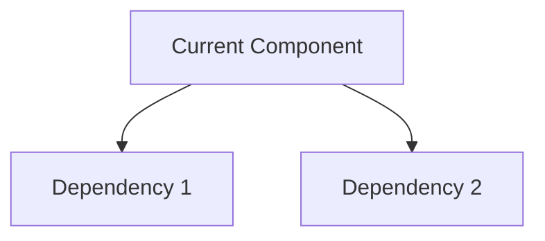
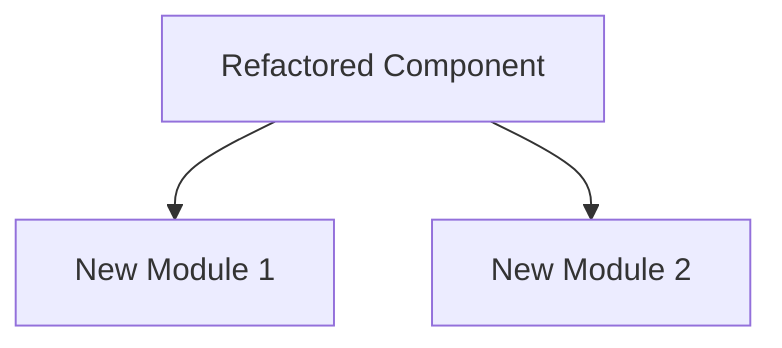

# Refactor Design Document: {target}

## Overview
- **Target:** {target module/component}
- **Author:** {author}
- **Date:** {date}
- **Priority:** {High | Medium | Low}
- **Estimated Effort:** {S | M | L | XL}

---

## 1. Motivation

### Current Problems
<!-- Why is this refactoring necessary? -->
-

### Goals
- [ ] Improve maintainability
- [ ] Reduce complexity
- [ ] Enhance performance
- [ ] Improve testability
- [ ] Other:

### Non-Goals
<!-- What is explicitly out of scope? -->
-

---

## 2. As-Is vs To-Be Code Structure

### As-Is (Current State)

#### Architecture Diagram


#### Current Structure
```
src/
├── current_file.ts
└── ...
```

#### Pain Points
| Issue | Location | Severity |
|-------|----------|----------|
|       |          |          |

#### Metrics (Current)
- Lines of Code:
- Cyclomatic Complexity:
- Test Coverage:
- Dependencies:

---

### To-Be (Target State)

#### Architecture Diagram


#### Target Structure
```
src/
├── new_structure/
│   ├── module1.ts
│   └── module2.ts
└── ...
```

#### Improvements
| Improvement | Description | Benefit |
|-------------|-------------|---------|
|             |             |         |

#### Metrics (Target)
- Lines of Code:
- Cyclomatic Complexity:
- Test Coverage:
- Dependencies:

---

## 3. Migration Plan

### Phase 1: Preparation
- [ ] Create feature branch
- [ ] Set up baseline tests
- [ ] Document current behavior

### Phase 2: Implementation Steps
| Step | Description | Files Affected | Risk |
|------|-------------|----------------|------|
| 1    |             |                |      |
| 2    |             |                |      |
| 3    |             |                |      |

### Phase 3: Cleanup
- [ ] Remove deprecated code
- [ ] Update documentation
- [ ] Archive migration notes

---

## 4. Regression Testing Strategy

### Existing Tests
| Test Suite | Coverage | Status |
|------------|----------|--------|
|            |          |        |

### New Tests Required
| Test Case | Type | Priority |
|-----------|------|----------|
|           |      |          |

### Manual Testing Checklist
- [ ]
- [ ]

### Rollback Plan
<!-- How to revert if issues are found -->
1.
2.

---

## 5. Risk Assessment

### Identified Risks
| Risk | Probability | Impact | Mitigation |
|------|-------------|--------|------------|
|      |             |        |            |

### Dependencies
- **Blocked By:**
- **Blocks:**

### Breaking Changes
- [ ] API Changes:
- [ ] Data Format Changes:
- [ ] Configuration Changes:

---

## 6. Success Criteria

### Functional
- [ ] All existing tests pass
- [ ] New tests pass
- [ ] No regression in functionality

### Non-Functional
- [ ] Performance maintained or improved
- [ ] Code complexity reduced
- [ ] Test coverage maintained or improved

### Sign-off
- [ ] Code Review Approved
- [ ] QA Verified
- [ ] Documentation Updated

---

## 7. References
- Related PRs:
- Design Documents:
- Technical Debt Tickets:
