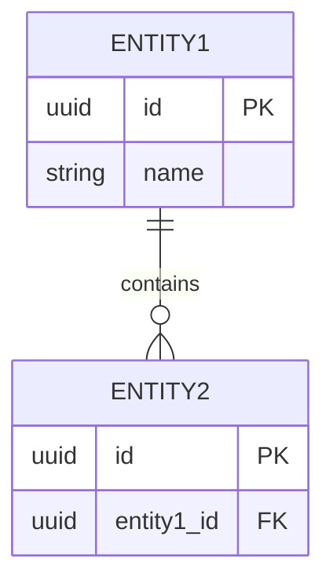
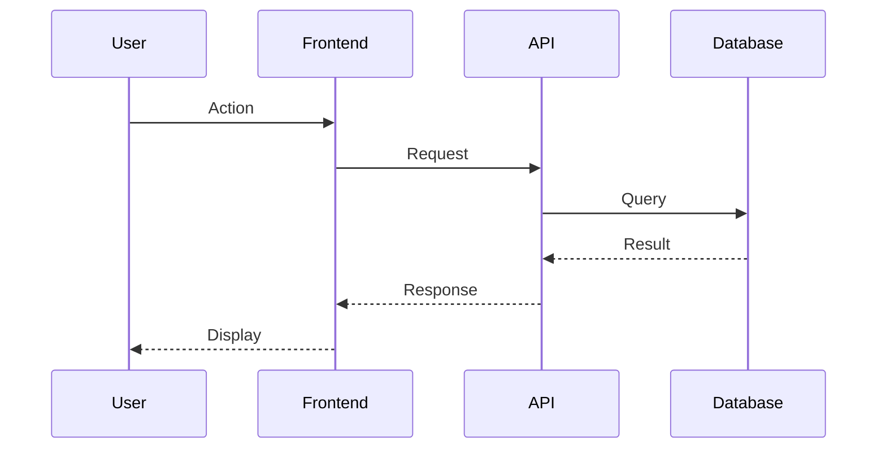
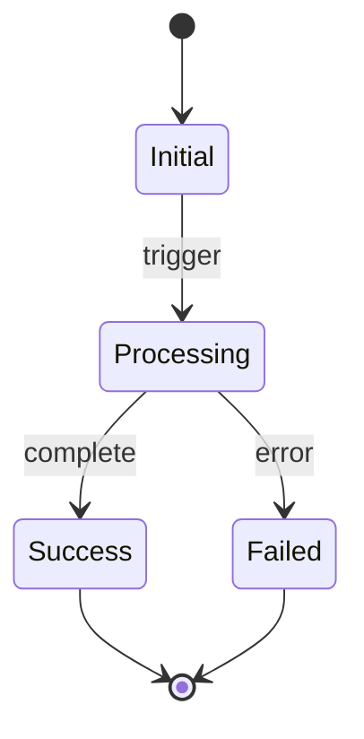

# Specification: {feature_name}

## 1. Overview
<!-- High-level description of the feature -->

### 1.1 Purpose
<!-- Why are we building this? -->

### 1.2 Scope
<!-- What is in scope / out of scope -->

| In Scope | Out of Scope |
|----------|--------------|
|          |              |

### 1.3 References
<!-- Link to research document and other relevant docs -->
- Research Document: `docs/research/{feature}.md`

---

## 2. User Stories

### US-001: {User Story Title}
**As a** {role}
**I want** {capability}
**So that** {benefit}

**Acceptance Criteria:**
- [ ] AC-001:
- [ ] AC-002:

### US-002: {User Story Title}
**As a** {role}
**I want** {capability}
**So that** {benefit}

**Acceptance Criteria:**
- [ ] AC-001:
- [ ] AC-002:

---

## 3. API Interface

### 3.1 Endpoints

#### `{METHOD} /api/v1/{resource}`

**Description:** {description}

**Request:**
```json
{
  "field1": "type (required|optional) - description"
}
```

**Response (200 OK):**
```json
{
  "field1": "type - description"
}
```

**Error Responses:**
| Status Code | Description |
|-------------|-------------|
| 400         | Bad Request |
| 401         | Unauthorized |
| 404         | Not Found |
| 500         | Internal Server Error |

---

## 4. Data Models

### 4.1 Entity: {EntityName}

| Field | Type | Required | Description |
|-------|------|----------|-------------|
| id    | UUID | Yes      | Primary key |
|       |      |          |             |

### 4.2 Entity Relationships



---

## 5. System Flow

### 5.1 Sequence Diagram



### 5.2 State Diagram (if applicable)



---

## 6. Edge Cases & Error Handling

| Scenario | Expected Behavior | Error Code |
|----------|-------------------|------------|
|          |                   |            |

---

## 7. Security Considerations

### 7.1 Authentication
<!-- How is the user authenticated? -->

### 7.2 Authorization
<!-- What permissions are required? -->

### 7.3 Data Protection
<!-- How is sensitive data handled? -->

---

## 8. Performance Requirements

| Metric | Target | Measurement Method |
|--------|--------|--------------------|
| Response Time | < 200ms | P95 latency |
| Throughput | > 1000 req/s | Load test |

---

## 9. Testing Strategy

### 9.1 Unit Tests
<!-- Key areas to unit test -->

### 9.2 Integration Tests
<!-- Key integration points to test -->

### 9.3 E2E Tests
<!-- Key user flows to test -->

---

## 10. Open Items
<!-- Any remaining questions or decisions -->
- [ ]

---
**Created:** {date}
**Last Updated:** {date}
**Status:** Draft | Review | Approved
**Author:**
